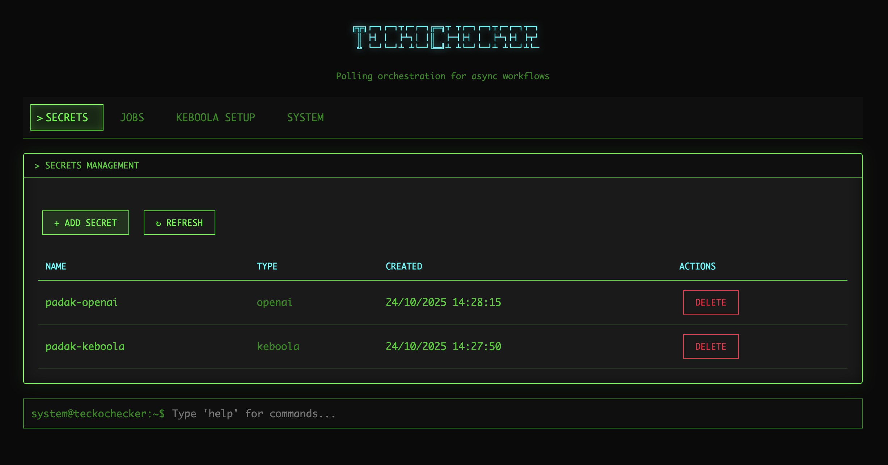
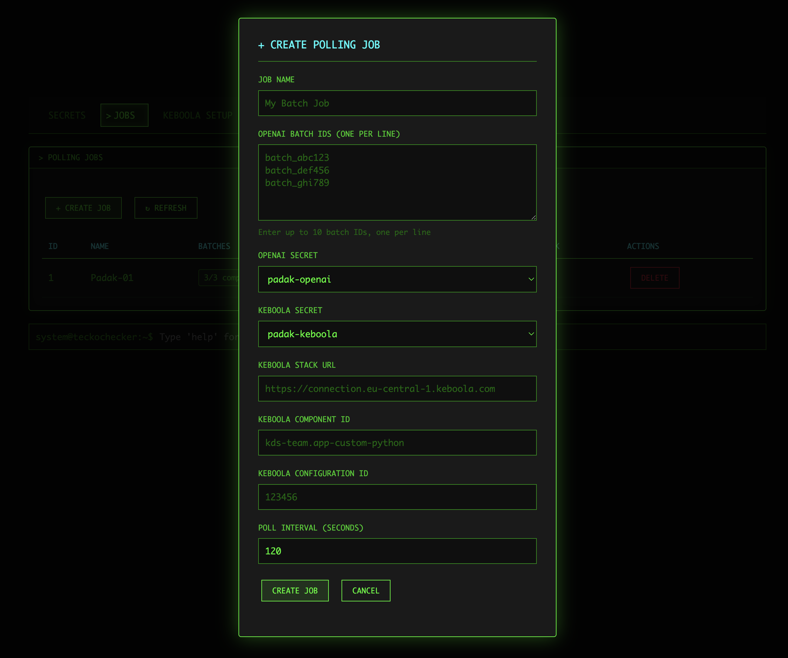
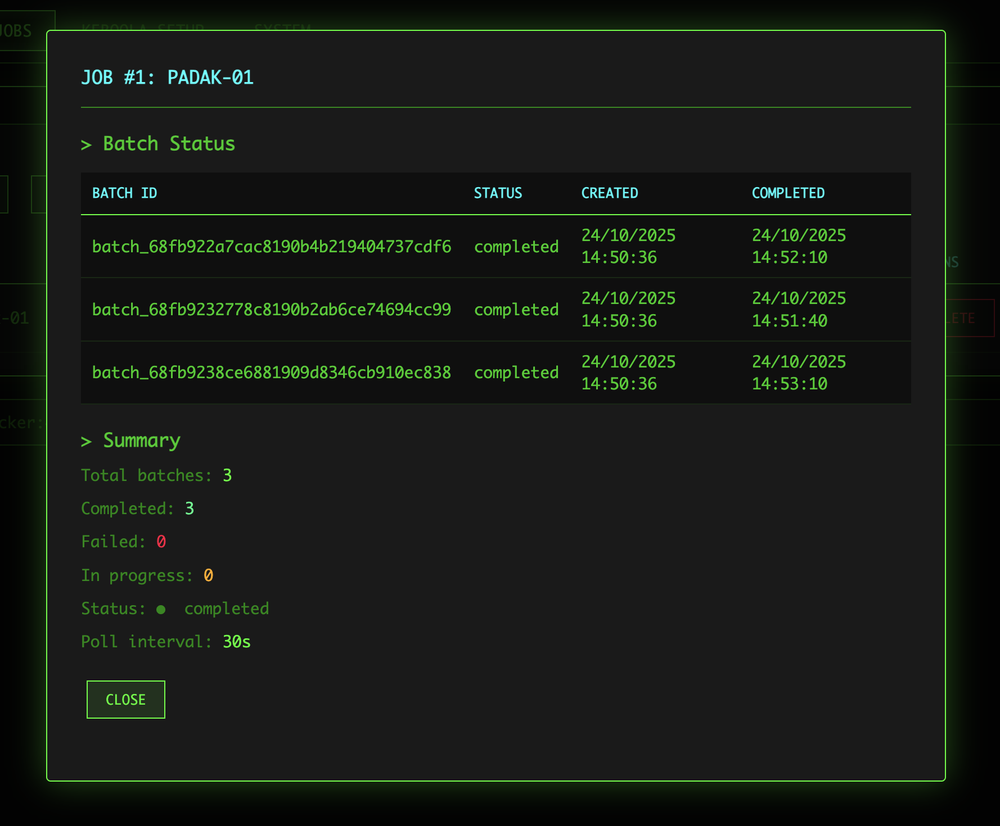
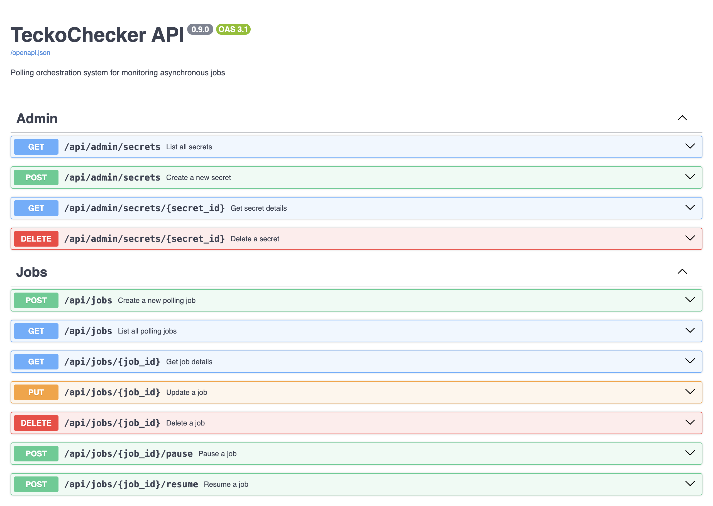

# TeckoChecker

A lightweight polling orchestration system that monitors asynchronous job statuses and triggers downstream workflows. TeckoChecker bridges the gap between OpenAI's batch processing capabilities and Keboola's data pipeline execution, automating the workflow from batch job completion to data processing.

## Key Features

- **Multi-Batch Monitoring** - Monitor up to 10 OpenAI batch jobs per polling job
- **Intelligent Triggering** - Keboola triggered when all batches complete (with metadata)
- **Batch Metadata** - Pass completion/failure info to Keboola jobs automatically
- **Concurrent Processing** - Check multiple batches in parallel with semaphore control
- **Web UI** - Terminal-style web interface for managing secrets, jobs, and monitoring
- **Automated Monitoring** - Continuous polling of OpenAI batch job completion status
- **Workflow Automation** - Automatic triggering of Keboola workflows when jobs complete
- **Secure Credentials** - AES-256 encrypted credential management
- **Flexible Polling** - Configurable intervals (30s - 1 hour) per job
- **REST API** - Full-featured API for programmatic access
- **Rich CLI** - Command-line interface with shell completion support

*This project was inspired by the idea of Tomáš Trnka (tomas.trnka@live.com), who is the spiritual father of this repository.*

## Quick Start

```bash
# Clone and install
git clone https://github.com/padak/teckochecker.git
cd teckochecker
python3 -m venv venv
source venv/bin/activate
pip install -r requirements.txt

# Initialize database and environment
python teckochecker.py init --generate-env

# Create API credentials
teckochecker secret create --name openai-prod --type openai
teckochecker secret create --name keboola-prod --type keboola

# Create multi-batch polling job
teckochecker job create \
  --name "My first multi-batch job" \
  --batch-id "batch_abc123" \
  --batch-id "batch_def456" \
  --openai-secret openai-prod \
  --keboola-secret keboola-prod \
  --keboola-stack https://connection.keboola.com \
  --component-id kds-team.app-custom-python \
  --config-id 12345

# Start the service
python teckochecker.py start

# Monitor progress
teckochecker job list

# Open Web UI
open http://127.0.0.1:8000/web
```

**See [docs/SETUP.md](docs/SETUP.md) for detailed setup instructions and configuration options.**

## Web Interface

TeckoChecker includes a terminal-style web UI with a retro hacker aesthetic:

```bash
# Start the server
python teckochecker.py start

# Access the Web UI
open http://127.0.0.1:8000/web
```

### Features

- 🔐 **Secrets Management** - Encrypted credentials (AES-256) for OpenAI and Keboola APIs
- 📋 **Jobs Dashboard** - Multi-batch job creation and monitoring
- 🎮 **Easter Eggs** - Hidden terminal commands (type `help` in the terminal)
- 🔧 **Keboola Setup** - Integration guide with variables and sample scripts
- ⚙️ **System Info** - Health checks and API documentation

### Screenshots

<table>
  <tr>
    <td><br/><em>Secrets Management</em></td>
    <td><br/><em>Create Multi-Batch Job</em></td>
  </tr>
  <tr>
    <td><br/><em>Job Monitoring</em></td>
    <td><br/><em>API Documentation</em></td>
  </tr>
</table>

See [docs/WEB_UI.md](docs/WEB_UI.md) for detailed Web UI documentation.

## Production Deployment

TeckoChecker can be deployed to AWS EC2 with Docker Compose and Caddy:

```bash
# Docker Compose with Caddy reverse proxy
docker-compose up -d

# Features:
# - Automatic HTTPS with Let's Encrypt
# - Basic Authentication (username/password)
# - Rate limiting (SlowAPI)
# - CORS configuration
```

See [Caddyfile.example](Caddyfile.example) for deployment template.

**Live Demo:** https://tt.keboola.ai/web/

## Documentation

- [docs/SETUP.md](docs/SETUP.md) - Setup and configuration guide
- [docs/USER_GUIDE.md](docs/USER_GUIDE.md) - Usage guide with multi-batch examples
- [docs/WEB_UI.md](docs/WEB_UI.md) - Web UI documentation
- [docs/EASTER_EGGS.md](docs/EASTER_EGGS.md) - Hidden terminal commands
- [docs/prd.md](docs/prd.md) - Product requirements and specifications
- [docs/architecture/](docs/architecture/) - Technical architecture
- [CHANGELOG.md](CHANGELOG.md) - Version history and release notes

## Development

The project uses a standard Python development workflow with virtual environments and pip. Development commands and common tasks can be run directly using Python tooling:

```bash
# Run tests
python -m pytest tests/

# Format code
black app/

# Lint
ruff check app/

# Run API server with auto-reload
python teckochecker.py start --reload
```

## License

This project is licensed under the Apache License 2.0 - see the [LICENSE](LICENSE) file for details.