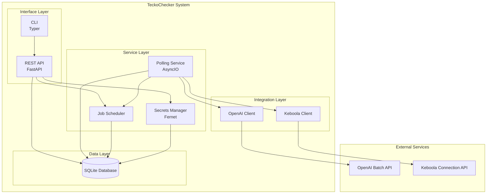
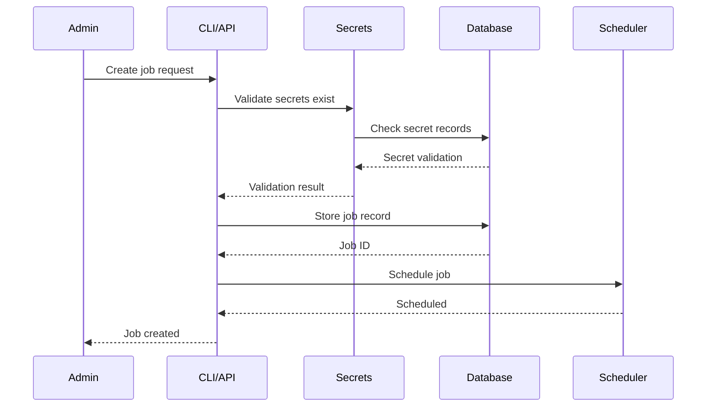
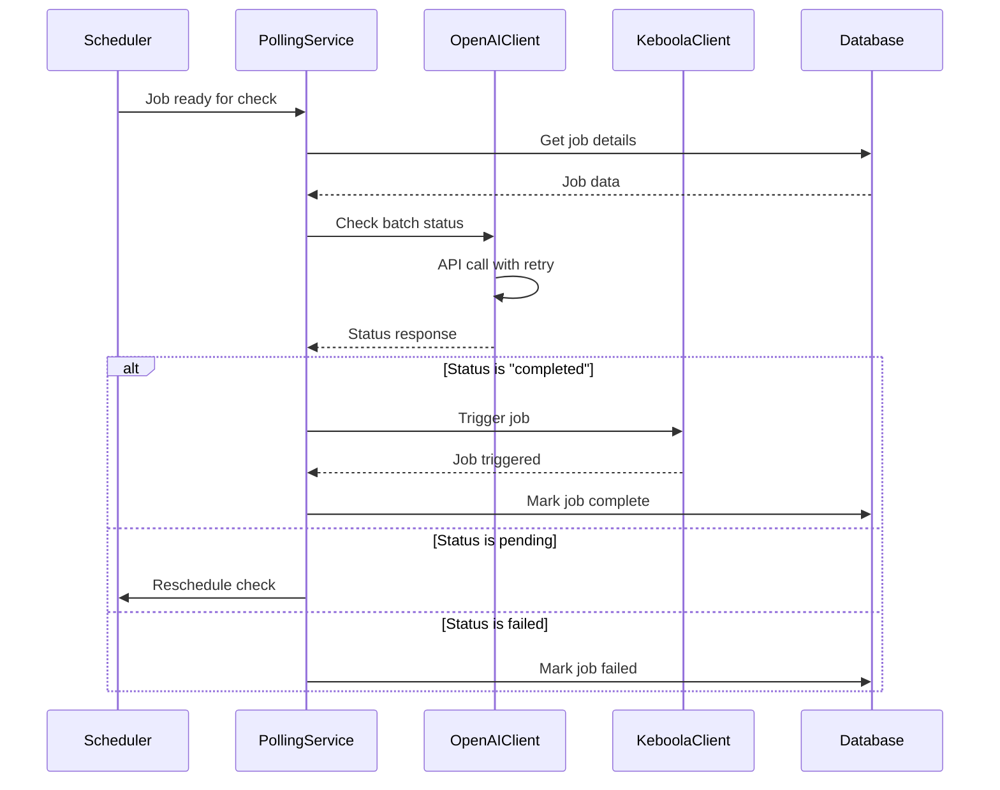

# TeckoChecker - System Architecture

## Overview

TeckoChecker is a lightweight polling orchestration system built with Python, FastAPI, and SQLite. It follows a modular, service-oriented architecture that prioritizes simplicity and extensibility.

## System Architecture Diagram



## Component Architecture

### 1. Interface Layer

#### REST API (FastAPI)
- **Purpose**: Provides RESTful endpoints for job and secret management
- **Technology**: FastAPI with Pydantic validation
- **Key Features**:
  - Automatic OpenAPI documentation
  - Request/response validation
  - Async request handling
  - CORS support for future UI

#### CLI (Typer)
- **Purpose**: Command-line interface for administrators
- **Technology**: Typer with Rich formatting
- **Key Features**:
  - Type hints for better DX
  - Auto-generated help
  - Progress indicators
  - Structured output

### 2. Service Layer

#### Polling Service
- **Purpose**: Core engine that checks job statuses
- **Technology**: Python AsyncIO with background tasks
- **Key Features**:
  - Concurrent job polling
  - Configurable intervals per job
  - Graceful error handling
  - Automatic retry logic

#### Secrets Manager
- **Purpose**: Secure storage and retrieval of API keys
- **Technology**: Fernet symmetric encryption
- **Key Features**:
  - AES-256 encryption
  - Key derivation from master secret
  - In-memory caching
  - Audit logging

#### Job Scheduler
- **Purpose**: Manages polling schedules and job lifecycle
- **Technology**: In-memory scheduler with DB persistence
- **Key Features**:
  - Dynamic interval adjustment
  - Priority queue for job execution
  - State management
  - Dead letter queue for failed jobs

### 3. Integration Layer

#### OpenAI Client
- **Purpose**: Interface with OpenAI Batch API
- **Technology**: Official OpenAI Python SDK
- **Key Features**:
  - Batch status checking
  - Rate limit handling
  - Exponential backoff
  - Response caching

#### Keboola Client
- **Purpose**: Trigger Keboola Connection jobs
- **Technology**: HTTP client with requests library
- **Key Features**:
  - Job triggering
  - Status monitoring
  - Error reporting
  - Timeout handling

### 4. Data Layer

#### SQLite Database
- **Purpose**: Persistent storage for jobs and secrets
- **Technology**: SQLite with SQLAlchemy ORM
- **Key Features**:
  - Zero configuration
  - ACID compliance
  - Concurrent reads
  - Automatic backups

## Data Flow

### Job Creation Flow


### Polling Execution Flow


## Directory Structure

```
teckochecker/
├── app/
│   ├── __init__.py
│   ├── main.py                 # FastAPI application entry
│   ├── config.py               # Configuration management
│   ├── database.py             # Database connection
│   ├── models.py              # SQLAlchemy models
│   ├── schemas.py             # Pydantic schemas
│   │
│   ├── api/
│   │   ├── __init__.py
│   │   ├── admin.py           # Admin endpoints
│   │   ├── jobs.py            # Job management endpoints
│   │   ├── system.py          # System endpoints
│   │   └── dependencies.py    # Shared dependencies
│   │
│   ├── services/
│   │   ├── __init__.py
│   │   ├── polling.py         # Polling engine
│   │   ├── scheduler.py       # Job scheduling
│   │   ├── secrets.py         # Secrets management
│   │   └── encryption.py      # Encryption utilities
│   │
│   ├── integrations/
│   │   ├── __init__.py
│   │   ├── openai_client.py   # OpenAI API integration
│   │   └── keboola_client.py  # Keboola API integration
│   │
│   └── cli/
│       ├── __init__.py
│       ├── main.py            # CLI entry point
│       ├── commands.py        # CLI commands
│       └── utils.py          # CLI utilities
│
├── tests/
│   ├── unit/
│   ├── integration/
│   └── fixtures/
│
├── migrations/
│   └── versions/
│
├── docs/
│   ├── prd.md
│   └── architecture.md
│
├── scripts/
│   ├── setup.sh
│   └── deploy.sh
│
├── requirements.txt
├── requirements-dev.txt
├── .env.example
├── .gitignore
├── Dockerfile
├── docker-compose.yml
└── README.md
```

## Technology Decisions

### Why SQLite?
- **Simplicity**: No external database server needed
- **Reliability**: Battle-tested, ACID compliant
- **Performance**: Sufficient for expected load
- **Portability**: Single file, easy backup
- **Migration Path**: Can migrate to PostgreSQL if needed

### Why FastAPI?
- **Modern**: Built on modern Python standards
- **Fast**: High performance with async support
- **Documentation**: Auto-generated OpenAPI/Swagger
- **Validation**: Built-in request/response validation
- **Type Safety**: Full type hints support

### Why Fernet Encryption?
- **Symmetric**: Simple key management for single-tenant
- **Standard**: Part of cryptography library
- **Secure**: AES-256 under the hood
- **Simple**: Easy to implement correctly

## Deployment Architecture

### Local Development
```yaml
Components:
  - SQLite: Local file
  - API: localhost:8000
  - CLI: Direct execution
  - Polling: Background thread
```

### Production Deployment (Simple Server)
```yaml
Components:
  - SQLite: /var/lib/teckochecker/db.sqlite
  - API: Systemd service + Nginx reverse proxy
  - CLI: System binary
  - Polling: Systemd service
  - Monitoring: Systemd journal
```

### Future: Docker Deployment
```yaml
Components:
  - SQLite: Docker volume
  - API: Container with Gunicorn
  - CLI: Docker exec
  - Polling: Separate container
  - Monitoring: Docker logs
```

## Security Architecture

### Secrets Management
```
Master Key (in ENV)
    → Fernet Instance
        → Encrypt/Decrypt Operations
            → Database Storage (encrypted)
```

### API Security (Future)
```
Request → API Key Validation → Rate Limiting → Request Processing
```

## Scalability Considerations

### Current Limitations
- Single SQLite writer (readers unlimited)
- Single polling process
- In-memory scheduling

### Scale-up Path
1. **Database**: SQLite → PostgreSQL
2. **Polling**: Single process → Multiple workers
3. **API**: Single instance → Load balanced
4. **Scheduling**: In-memory → Redis

## Monitoring & Observability

### Logging Strategy
```python
Levels:
  - DEBUG: Detailed execution flow
  - INFO: Job status changes
  - WARNING: Retry attempts, degraded performance
  - ERROR: Failed operations
  - CRITICAL: System failures

Outputs:
  - Console: Development
  - File: Production (rotating)
  - Future: Centralized logging
```

### Metrics (Future)
- Jobs processed per hour
- Average polling latency
- API response times
- Error rates by type
- Resource utilization

## Error Handling Strategy

### Retry Logic
```python
Exponential Backoff:
  - Initial: 1 second
  - Multiplier: 2
  - Max delay: 60 seconds
  - Max attempts: 3

Circuit Breaker (Future):
  - Threshold: 5 failures
  - Timeout: 5 minutes
  - Half-open trials: 1
```

### Failure Modes
1. **OpenAI API Down**: Continue polling, log errors
2. **Keboola API Down**: Retry with backoff, alert admin
3. **Database Corruption**: Fallback to backup, alert admin
4. **Out of Memory**: Graceful shutdown, systemd restart

---

*Document Version: 1.0*
*Last Updated: 2025-01-22*
*Status: Ready for Implementation*