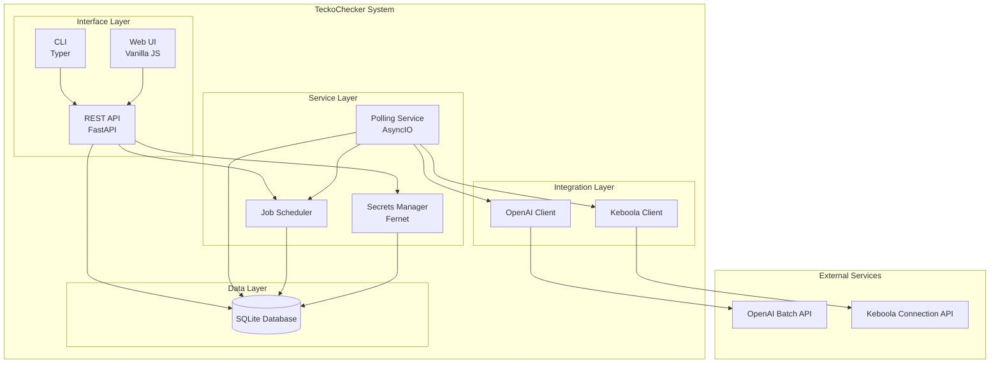
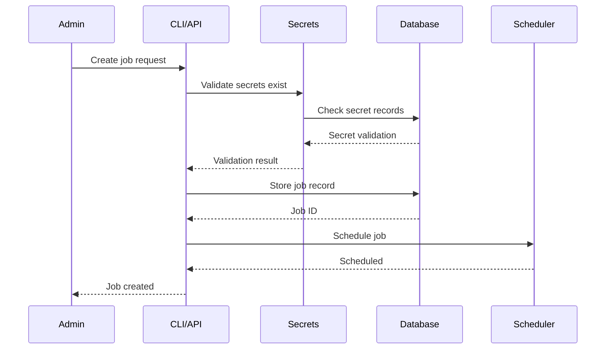
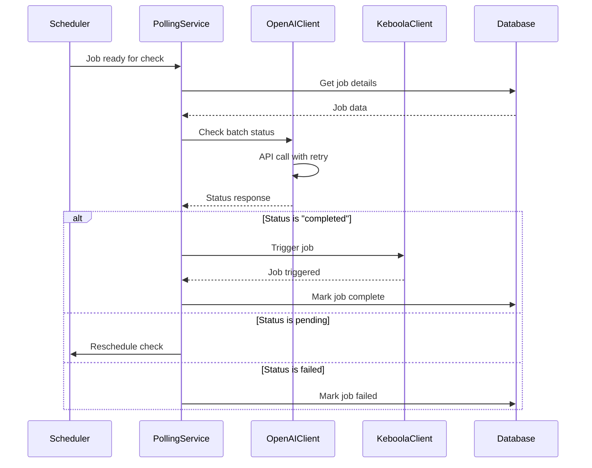

# TeckoChecker - System Architecture

## Overview

TeckoChecker is a lightweight polling orchestration system built with Python, FastAPI, and SQLite. It follows a modular, service-oriented architecture that prioritizes simplicity and extensibility.

## System Architecture Diagram



## Component Architecture

### 1. Interface Layer

#### REST API (FastAPI)
- **Purpose**: Provides RESTful endpoints for job and secret management
- **Technology**: FastAPI with Pydantic validation
- **Key Features**:
  - Automatic OpenAPI documentation
  - Request/response validation
  - Async request handling
  - CORS support for web UI

#### CLI (Typer)
- **Purpose**: Command-line interface for administrators
- **Technology**: Typer with Rich formatting
- **Key Features**:
  - Type hints for better DX
  - Auto-generated help
  - Progress indicators
  - Structured output

#### Web UI (Vanilla JavaScript)
- **Purpose**: Browser-based interface for job and secret management
- **Technology**: Pure HTML5/CSS3/JavaScript (ES6+), no frameworks
- **Size**: 1,290 lines of code total
- **Architecture**:
  - `static/`: Frontend assets
    - `index.html`: Single-page application (240 lines)
    - `css/terminal.css`: Terminal-style theme (448 lines)
    - `js/api.js`: REST API client (133 lines)
    - `js/app.js`: Application logic (440 lines)
  - `routes.py`: FastAPI routes for serving web UI (29 lines)
- **Key Features**:
  - Terminal/hacker aesthetic matching CLI design
  - Real-time monitoring with auto-refresh (5-second intervals)
  - Keyboard shortcuts and responsive design
  - No build process required (pure vanilla JavaScript)
  - Five main tabs: Secrets, Jobs, Monitor, Logs, System Info
  - Status indicators with animations (pulsing dots for active jobs)
  - Modal-based forms for creating/editing resources
  - Color-coded log messages (green/yellow/red)
- **Access**: http://localhost:8000/web

### 2. Service Layer

#### Polling Service
- **Purpose**: Core engine that checks job statuses
- **Technology**: Python AsyncIO with background tasks
- **Key Features**:
  - Concurrent job polling
  - Configurable intervals per job
  - Graceful error handling
  - Automatic retry logic

#### Secrets Manager
- **Purpose**: Secure storage and retrieval of API keys
- **Technology**: Fernet symmetric encryption
- **Key Features**:
  - AES-256 encryption
  - Key derivation from master secret
  - In-memory caching
  - Audit logging

#### Job Scheduler
- **Purpose**: Manages polling schedules and job lifecycle
- **Technology**: In-memory scheduler with DB persistence
- **Key Features**:
  - Dynamic interval adjustment
  - Priority queue for job execution
  - State management
  - Dead letter queue for failed jobs

### 3. Integration Layer

#### OpenAI Client
- **Purpose**: Interface with OpenAI Batch API
- **Technology**: Official OpenAI Python SDK
- **Key Features**:
  - Batch status checking
  - Rate limit handling
  - Exponential backoff
  - Response caching

#### Keboola Client
- **Purpose**: Trigger Keboola Connection jobs
- **Technology**: HTTP client with requests library
- **Key Features**:
  - Job triggering
  - Status monitoring
  - Error reporting
  - Timeout handling

### 4. Data Layer

#### SQLite Database
- **Purpose**: Persistent storage for jobs and secrets
- **Technology**: SQLite with SQLAlchemy ORM
- **Key Features**:
  - Zero configuration
  - ACID compliance
  - Concurrent reads
  - Automatic backups

## Data Flow

### Job Creation Flow


### Polling Execution Flow


## Directory Structure

```
teckochecker/
├── app/
│   ├── __init__.py
│   ├── main.py                 # FastAPI application entry
│   ├── config.py               # Configuration management
│   ├── database.py             # Database connection
│   ├── models.py              # SQLAlchemy models
│   ├── schemas.py             # Pydantic schemas
│   │
│   ├── api/
│   │   ├── __init__.py
│   │   ├── admin.py           # Admin endpoints
│   │   ├── jobs.py            # Job management endpoints
│   │   └── system.py          # System endpoints
│   │
│   ├── web/                   # Web UI (1,290 lines)
│   │   ├── __init__.py
│   │   ├── routes.py          # Web UI routes
│   │   └── static/
│   │       ├── index.html     # Single-page app
│   │       ├── css/
│   │       │   └── terminal.css  # Terminal theme
│   │       └── js/
│   │           ├── api.js     # API client
│   │           └── app.js     # App logic
│   │
│   ├── services/
│   │   ├── __init__.py
│   │   ├── polling.py         # Polling engine
│   │   ├── scheduler.py       # Job scheduling
│   │   ├── secrets.py         # Secrets management
│   │   └── encryption.py      # Encryption utilities
│   │
│   ├── integrations/
│   │   ├── __init__.py
│   │   ├── openai_client.py   # OpenAI API integration
│   │   └── keboola_client.py  # Keboola API integration
│   │
│   └── cli/
│       ├── __init__.py
│       ├── main.py            # CLI entry point
│       ├── commands.py        # CLI commands
│       └── utils.py          # CLI utilities
│
├── tests/
│   ├── unit/
│   ├── integration/
│   └── fixtures/
│
├── docs/
│   ├── prd.md
│   ├── SETUP.md
│   ├── USER_GUIDE.md
│   └── architecture/
│       ├── README.md          # This file
│       └── web-ui-design.md
│
├── scripts/
│   ├── init_db.py
│   ├── verify_setup.py
│   └── test_integration.py
│
├── Makefile                   # Development automation
├── requirements.txt
├── .env.example
├── .gitignore
├── teckochecker.py           # Main CLI entry point
└── README.md
```

## Technology Decisions

### Why SQLite?
- **Simplicity**: No external database server needed
- **Reliability**: Battle-tested, ACID compliant
- **Performance**: Sufficient for expected load
- **Portability**: Single file, easy backup
- **Migration Path**: Can migrate to PostgreSQL if needed

### Why FastAPI?
- **Modern**: Built on modern Python standards
- **Fast**: High performance with async support
- **Documentation**: Auto-generated OpenAPI/Swagger
- **Validation**: Built-in request/response validation
- **Type Safety**: Full type hints support

### Why Fernet Encryption?
- **Symmetric**: Simple key management for single-tenant
- **Standard**: Part of cryptography library
- **Secure**: AES-256 under the hood
- **Simple**: Easy to implement correctly

## Deployment Architecture

### Local Development
```yaml
Components:
  - SQLite: Local file (teckochecker.db)
  - API: localhost:8000
  - Web UI: http://localhost:8000/web
  - CLI: Direct execution via teckochecker.py
  - Polling: Background asyncio task (starts with API)

Setup Commands:
  - make install      # Create venv and install dependencies
  - make db-init      # Initialize database
  - make run-api      # Start API server with auto-reload
  - Access Web UI at http://localhost:8000/web
  - Access API docs at http://localhost:8000/docs
```

### Production Deployment (Simple Server)
```yaml
Components:
  - SQLite: /var/lib/teckochecker/db.sqlite
  - API: Systemd service on port 8000
  - Web UI: Served by API at /web endpoint
  - CLI: System binary (teckochecker)
  - Polling: Asyncio background task (same process as API)
  - Reverse Proxy: Nginx (optional, for HTTPS)
  - Monitoring: Systemd journal + web UI logs tab

Deployment Steps:
  1. Clone repository to server
  2. Create virtual environment
  3. Install dependencies from requirements.txt
  4. Configure .env file with SECRET_KEY
  5. Initialize database: python scripts/init_db.py
  6. Create systemd service file
  7. Enable and start service
  8. Configure Nginx reverse proxy (optional)
```

### Docker Deployment (Optional)
```yaml
Note: Docker commands are available in Makefile but Dockerfile
      is not included in the repository.

Available Commands:
  - make docker-build   # Build Docker image
  - make docker-run     # Run container on port 8000
  - make docker-stop    # Stop and remove container
  - make docker-logs    # View container logs
  - make docker-shell   # Open bash shell in container

Components:
  - SQLite: Docker volume for persistence
  - API: Uvicorn server in container
  - Web UI: Served by API
  - CLI: Access via docker exec
  - Polling: Same container as API
```

## Security Architecture

### Secrets Management
```
Master Key (in ENV)
    → Fernet Instance
        → Encrypt/Decrypt Operations
            → Database Storage (encrypted)
```

### API Security (Future)
```
Request → API Key Validation → Rate Limiting → Request Processing
```

## Scalability Considerations

### Current Limitations
- Single SQLite writer (readers unlimited)
- Single polling process
- In-memory scheduling

### Scale-up Path
1. **Database**: SQLite → PostgreSQL
2. **Polling**: Single process → Multiple workers
3. **API**: Single instance → Load balanced
4. **Scheduling**: In-memory → Redis

## Monitoring & Observability

### Logging Strategy
```python
Levels:
  - DEBUG: Detailed execution flow
  - INFO: Job status changes
  - WARNING: Retry attempts, degraded performance
  - ERROR: Failed operations
  - CRITICAL: System failures

Outputs:
  - Console: Development
  - File: Production (rotating)
  - Future: Centralized logging
```

### Metrics (Future)
- Jobs processed per hour
- Average polling latency
- API response times
- Error rates by type
- Resource utilization

## Error Handling Strategy

### Retry Logic
```python
Exponential Backoff:
  - Initial: 1 second
  - Multiplier: 2
  - Max delay: 60 seconds
  - Max attempts: 3

Circuit Breaker (Future):
  - Threshold: 5 failures
  - Timeout: 5 minutes
  - Half-open trials: 1
```

### Failure Modes
1. **OpenAI API Down**: Continue polling, log errors
2. **Keboola API Down**: Retry with backoff, alert admin
3. **Database Corruption**: Fallback to backup, alert admin
4. **Out of Memory**: Graceful shutdown, systemd restart

## Development Tools

### Makefile Commands
The project includes a comprehensive Makefile for development automation:

```bash
# Setup and Installation
make install        # Create venv and install dependencies
make dev           # Complete dev setup (install + env + db)
make env           # Create .env from .env.example with generated SECRET_KEY

# Database Management
make db-init       # Initialize database
make db-reset      # Reset database (drop and recreate)
make db-show       # Show database schema
make clean-db      # Remove database file

# Running the Application
make run-api       # Start API server with auto-reload (dev mode)
make run-api-prod  # Start API in production mode
make run-cli       # Show CLI help
make start         # Alias for run-api
make serve         # Alias for run-api

# Testing
make test          # Run all tests with coverage report
make test-unit     # Run unit tests only
make test-integration # Run integration tests
make test-fast     # Run tests without coverage (faster)
make test-api      # Run API test script

# Code Quality
make format        # Format code with black and ruff
make format-check  # Check formatting without changes
make lint          # Lint code with ruff
make type-check    # Run type checking with mypy
make check         # Run all quality checks

# Docker (Optional)
make docker-build  # Build Docker image
make docker-run    # Run Docker container
make docker-stop   # Stop and remove Docker container
make docker-logs   # View Docker container logs
make docker-shell  # Open shell in Docker container

# Utilities
make clean         # Remove venv, cache files, build artifacts
make verify        # Verify setup configuration
make shell         # Open Python shell with app context
make deps-update   # Update all dependencies
make deps-list     # List installed dependencies
make help          # Show all available commands
```

### Quick Start with Makefile
```bash
# First time setup
make dev           # Creates venv, .env, and initializes database

# Daily development
make run-api       # Start the API server

# Before committing
make format        # Format code
make test          # Run tests
make lint          # Check code quality
```

---

*Document Version: 1.1*
*Last Updated: 2025-10-22*
*Status: MVP Complete with Web UI*