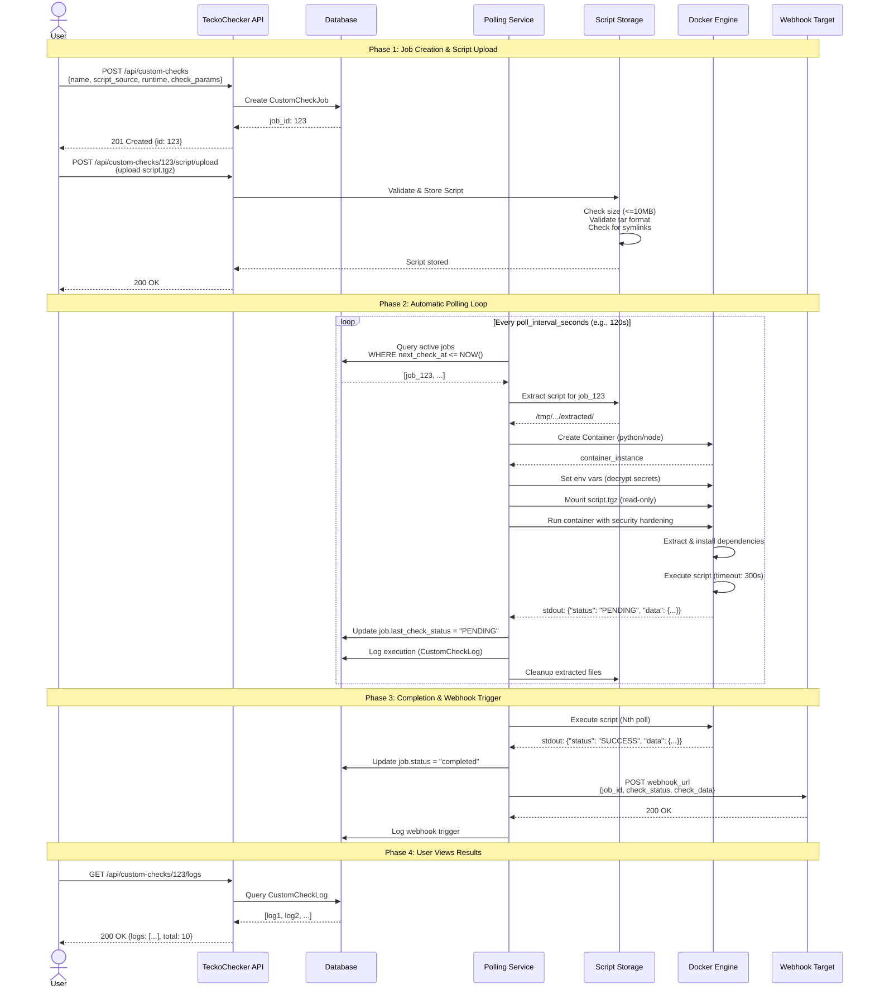
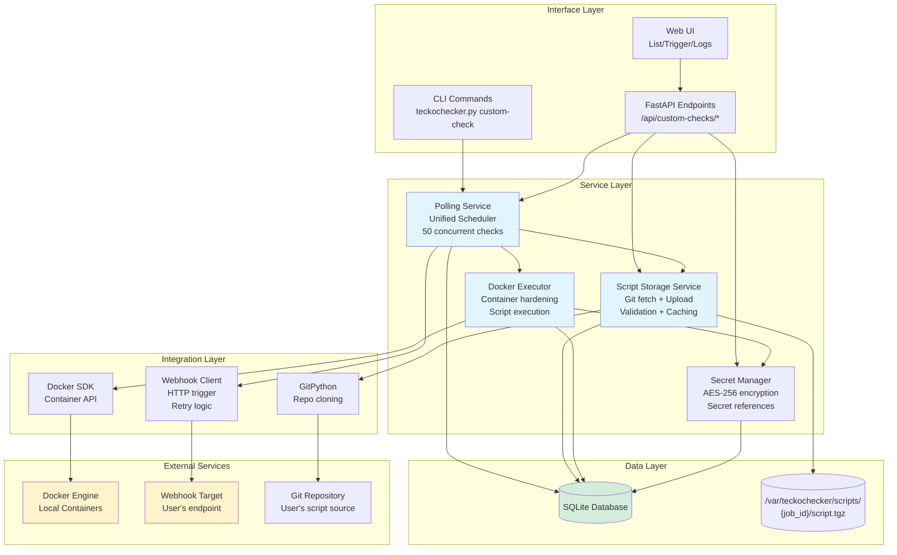

# TeckoChecker Custom Check Jobs - Product & Technical Specification

**Document Version:** 1.1
**Last Updated:** 2025-01-25
**Status:** Ready for Implementation (Post-Codex Review Round 2)
**Author:** Padak
**Reviewers:** Codex (GPT-5-Codex)

---

## Table of Contents

1. [Introduction](#introduction)
2. [Use Cases and Requirements](#use-cases-and-requirements)
3. [Feature Scope and Integration Strategy](#feature-scope-and-integration-strategy)
4. [Tech Stack](#tech-stack)
5. [Data Models and Schema](#data-models-and-schema)
6. [Component Architecture](#component-architecture)
7. [API Design](#api-design)
8. [Script Output Specification](#script-output-specification)
9. [Performance and Scalability](#performance-and-scalability)
10. [Security](#security)
11. [Testing Strategy](#testing-strategy)
12. [Implementation Phases](#implementation-phases)
13. [Open Questions and Future Enhancements](#open-questions-and-future-enhancements)

---

## Introduction

### Vision

Transform TeckoChecker from a specialized "OpenAI batch poller" into a **universal async task monitoring platform** with pluggable check logic. Enable users to monitor arbitrary async processes (Gemini API, custom pipelines, CI/CD jobs) by providing their own check scripts that execute safely in Docker containers.

### Current State vs. Target State

**Current State:**
```
TeckoChecker → OpenAI API (hardcoded) → check batch status → trigger Keboola
```

**Target State:**
```
TeckoChecker → Custom Script (user-defined) → check anything → trigger webhook/Keboola
                ↓
           Docker Container (safe, isolated, cost-effective execution)
```

### Key Differentiators

- **Flexibility**: Monitor any async task, not just OpenAI batches
- **Safety**: Execute untrusted user code in isolated Docker containers with resource limits
- **Cost-Effective**: Local Docker execution - no external API costs
- **Simplicity**: Standard output format (JSON with status field)
- **Scale**: Handle 500+ active jobs with 50+ concurrent checks
- **Extensibility**: Python and Node.js support with dependency management
- **Control**: Full control over execution environment and security policies

### Relationship to Existing Architecture

This feature **extends** TeckoChecker's existing polling architecture without modifying the current OpenAI polling flow. Both systems run in parallel:
- **Existing**: `PollingJob` for OpenAI batch monitoring (unchanged)
- **New**: `CustomCheckJob` for generic async task monitoring

Future versions may consolidate OpenAI polling as a built-in custom check, but v1.0 maintains backward compatibility.

---

## High-Level Architecture Diagrams

### User Journey - Sequence Diagram



### System Architecture - Component Diagram



---

## Use Cases and Requirements

### Use Case 1: Monitor Gemini API Batch Jobs

**Actor:** Data Engineer
**Goal:** Poll Gemini API batch status similar to OpenAI

**Flow:**
1. Upload Python script that calls Gemini API
2. Configure env vars (API key via secret reference)
3. Schedule polling every 2 minutes
4. Trigger webhook when batch completes

**Success Criteria:**
- Script executes in isolated sandbox
- Gemini API credentials injected securely
- Webhook triggered with completion data

---

### Use Case 2: Custom Async Task Monitoring

**Actor:** DevOps Engineer
**Goal:** Monitor arbitrary async processes (CI/CD jobs, data pipelines, ML training)

**Flow:**
1. Provide GitHub URL to check script
2. Configure check parameters (job ID, API endpoint)
3. Poll status until completion
4. Trigger action (webhook, Slack notification)

**Success Criteria:**
- Script fetched from Git on every poll (fresh commit)
- Dependencies installed automatically
- Flexible output schema

---

### Use Case 3: Multi-Provider Batch Jobs

**Actor:** ML Engineer
**Goal:** Monitor batch jobs across multiple AI providers

**Flow:**
1. Create multiple custom check jobs (OpenAI, Anthropic, Gemini)
2. Each job has provider-specific script
3. Monitor all jobs concurrently
4. Aggregate results via webhook

**Success Criteria:**
- Multiple jobs run in parallel
- No cross-contamination between scripts
- Concurrent execution scales to 50+ jobs

---

### Functional Requirements

| ID | Requirement | Priority |
|----|-------------|----------|
| FR-1 | Support both Git URL and direct file upload as script sources | **MUST** |
| FR-2 | Execute scripts in Python or Node.js runtimes | **MUST** |
| FR-3 | Auto-install dependencies from requirements.txt / package.json | **MUST** |
| FR-4 | Inject environment variables (with secret references) | **MUST** |
| FR-5 | Parse standardized JSON output from scripts | **MUST** |
| FR-6 | Trigger generic HTTP webhooks on completion | **MUST** |
| FR-7 | Support configurable timeouts per job | **SHOULD** |
| FR-8 | Store script execution logs and outputs | **MUST** |
| FR-9 | Provide CLI and API interfaces for management | **MUST** |
| FR-10 | Maintain backward compatibility with existing OpenAI polling | **MUST** |

---

### Non-Functional Requirements

| ID | Requirement | Target |
|----|-------------|--------|
| NFR-1 | **Scale**: Support 500+ active jobs | 500 concurrent jobs |
| NFR-2 | **Concurrency**: Execute 50+ checks simultaneously | 50 parallel Docker containers |
| NFR-3 | **Latency**: Start script execution within 5 seconds | < 5s from poll trigger |
| NFR-4 | **Isolation**: Zero cross-contamination between script executions | 100% isolation |
| NFR-5 | **Security**: Encrypted secret storage, no credential leakage | AES-256 encryption |
| NFR-6 | **Reliability**: 99% polling loop uptime | Graceful error handling |
| NFR-7 | **Storage**: Limit script size to 10MB (compressed) | Max 10MB .tgz |

---

## Feature Scope and Integration Strategy

### In-Scope (v1.0)

✅ **Core Infrastructure:**
- Database schema (`custom_check_jobs`, `custom_check_logs`) with WAL mode
- Script storage service (filesystem-based with Git caching)
- Docker executor service (Python/Node with security hardening)
- Generic webhook trigger client (with retry logic)

✅ **API Layer:**
- CRUD endpoints for custom check jobs
- Script upload/Git config endpoints
- Job control (pause/resume/trigger)
- Execution log retrieval

✅ **CLI Interface:**
- `teckochecker.py custom-check create/list/delete`
- `teckochecker.py custom-check upload-script`
- `teckochecker.py custom-check trigger`

✅ **Polling Integration:**
- Extend existing `PollingService` to process both job types
- Unified scheduler for `PollingJob` and `CustomCheckJob`
- Retry logic with exponential backoff for Docker container creation and webhook triggers
- Prometheus metrics and structured logging

✅ **Web UI (Basic):**
- List custom check jobs
- View execution logs
- Manual trigger button

---

### Out-of-Scope (Future)

❌ **Not in v1.0:**
- Script versioning/rollback
- Multi-step workflows (DAGs)
- Advanced webhook features (circuit breaker, custom retry strategies)
- Script marketplace/templates
- Metrics dashboard (Prometheus/Grafana)
- PostgreSQL support (SQLite only)

---

## Tech Stack

### New Dependencies

| Dependency | Version | Purpose |
|-----------|---------|---------|
| **docker** (python-docker) | ^7.0.0 | Docker SDK for container execution and management |
| **GitPython** | ^3.1.40 | Clone Git repositories for script fetching |
| **uv** | ^0.1.0 | Fast Python package installer (used in Docker images) |
| **tarfile** (stdlib) | - | Create/extract .tgz archives |
| **prometheus-client** | ^0.19.0 | Metrics export for observability |
| **structlog** | ^24.1.0 | Structured logging for better debugging |

### Existing Stack (Unchanged)

- Python 3.11+
- FastAPI 0.104+
- **Pydantic 2.12.3** (supports `@field_validator`)
- SQLAlchemy 2.0+
- **SQLite 3.38+** (WAL mode enabled for concurrent writes)
- asyncio for concurrency
- httpx for async HTTP client (existing)

### Docker Execution Environment

TeckoChecker v1.0 uses **Docker as the exclusive execution runtime**. This decision prioritizes operational simplicity, cost-effectiveness, and security control over the complexity of supporting multiple runtimes.

#### Why Docker-Only?

**Advantages:**
- ✅ **Fast execution** - No network latency, local execution
- ✅ **Cost-effective** - Zero external API costs
- ✅ **Full control** - Complete ownership of security policies and resource limits
- ✅ **On-premise friendly** - No external dependencies
- ✅ **Predictable performance** - No external service rate limits
- ✅ **Enhanced security** - Container hardening with user namespaces, seccomp, AppArmor
- ✅ **Simpler operations** - Single runtime to monitor and debug

**Requirements:**
- Docker Engine 20.10+ installed on server
- Sufficient disk space for Docker images and container volumes
- CPU/memory capacity for concurrent container execution (50 concurrent = ~25GB RAM recommended)

#### Built-in Docker Images

| Image | Base | Pre-installed | Size | Use Case |
|-------|------|---------------|------|----------|
| `teckochecker/runner:python-3.11` | python:3.11-slim | uv, ca-certificates | ~150MB | Python scripts with fast dependency installation |
| `teckochecker/runner:node-20` | node:20-slim | npm, yarn (optional) | ~200MB | Node.js scripts |

**Image Build Process:**
```dockerfile
# docker/Dockerfile.python
FROM python:3.11-slim

# Security: Run as non-root user
RUN useradd -m -u 1000 runner && \
    pip install --no-cache-dir uv

USER runner
WORKDIR /workspace

CMD ["/bin/bash"]
```

**Custom Images:** Users can optionally specify custom Docker images (future v1.1+). Security validation will include:
- Image must be from trusted registry (Docker Hub, private registry)
- Image size limit: 1GB (prevents bloat)
- Non-root user required (enforced)

### Script Runtime Environments

Scripts execute in isolated Docker containers with:
- **Python**: 3.11+ with **uv** (fast package installation, ~10x faster than pip)
- **Node.js**: 20+ with npm
- **Resource Limits**: 512MB RAM, 0.5 CPU per container (configurable)
- **Network**: Bridge mode with optional egress restrictions (see Security section)
- **Timeout**: Configurable per job (default 300s, max 3600s)

---

## Data Models and Schema

### New Table: `custom_check_jobs`

```sql
CREATE TABLE custom_check_jobs (
    -- Core fields
    id INTEGER PRIMARY KEY AUTOINCREMENT,
    name VARCHAR(255) NOT NULL,

    -- Script configuration
    script_source_type VARCHAR(20) NOT NULL, -- 'git' or 'upload'
    script_git_url VARCHAR(500),
    script_git_branch VARCHAR(100),
    script_file_path VARCHAR(500),          -- Path to local .tgz
    script_runtime VARCHAR(20) NOT NULL,    -- 'python' or 'node'
    script_entrypoint VARCHAR(255) NOT NULL DEFAULT 'main.py',

    -- Execution configuration
    check_params TEXT NOT NULL,             -- JSON: {"batch_id": "..."}
    env_vars TEXT,                          -- JSON: {"API_KEY": "secret_ref:1"}
    timeout_seconds INTEGER DEFAULT 300,
    resource_limits TEXT,                   -- JSON: {"memory_mb": 512, "cpu_cores": 0.5}

    -- Webhook action
    webhook_url VARCHAR(500),
    webhook_method VARCHAR(10) DEFAULT 'POST',
    webhook_headers TEXT,                   -- JSON
    webhook_query_params TEXT,              -- JSON: For GET webhooks

    -- Polling configuration
    poll_interval_seconds INTEGER DEFAULT 120,

    -- Status tracking
    status VARCHAR(50) NOT NULL DEFAULT 'active', -- active, paused, completed, failed
    last_check_status VARCHAR(50),          -- Script output status
    last_check_data TEXT,                   -- JSON from script

    -- Timestamps
    last_check_at DATETIME,
    next_check_at DATETIME,
    created_at DATETIME NOT NULL DEFAULT CURRENT_TIMESTAMP,
    completed_at DATETIME,

    -- Indexes
    INDEX idx_custom_check_status (status),
    INDEX idx_custom_check_next_check (next_check_at)
);
```

### New Table: `custom_check_logs`

```sql
CREATE TABLE custom_check_logs (
    id INTEGER PRIMARY KEY AUTOINCREMENT,
    job_id INTEGER NOT NULL,
    status VARCHAR(50) NOT NULL,            -- checking, success, failed, error
    message TEXT,
    script_output TEXT,                     -- Full JSON output from script
    execution_time_ms INTEGER,
    created_at DATETIME NOT NULL DEFAULT CURRENT_TIMESTAMP,

    FOREIGN KEY (job_id) REFERENCES custom_check_jobs(id) ON DELETE CASCADE,
    INDEX idx_custom_log_job_created (job_id, created_at),
    INDEX idx_custom_log_status (status)
);
```

### SQLAlchemy Models

```python
class CustomCheckJob(Base):
    """Polling job for custom user-defined check scripts."""
    __tablename__ = "custom_check_jobs"

    id: Mapped[int] = mapped_column(Integer, primary_key=True)
    name: Mapped[str] = mapped_column(String(255), nullable=False)

    # Script configuration
    script_source_type: Mapped[str] = mapped_column(String(20), nullable=False)
    script_git_url: Mapped[Optional[str]] = mapped_column(String(500))
    script_git_branch: Mapped[Optional[str]] = mapped_column(String(100), default="main")
    script_file_path: Mapped[Optional[str]] = mapped_column(String(500))
    script_runtime: Mapped[str] = mapped_column(String(20), nullable=False)
    script_entrypoint: Mapped[str] = mapped_column(String(255), default="main.py")

    # Execution configuration
    check_params: Mapped[str] = mapped_column(Text, nullable=False)  # JSON
    env_vars: Mapped[Optional[str]] = mapped_column(Text)  # JSON
    timeout_seconds: Mapped[int] = mapped_column(Integer, default=300)
    resource_limits: Mapped[Optional[str]] = mapped_column(Text)  # JSON: {"memory_mb": 512, "cpu_cores": 0.5}

    # Webhook action
    webhook_url: Mapped[Optional[str]] = mapped_column(String(500))
    webhook_method: Mapped[str] = mapped_column(String(10), default="POST")
    webhook_headers: Mapped[Optional[str]] = mapped_column(Text)  # JSON
    webhook_query_params: Mapped[Optional[str]] = mapped_column(Text)  # JSON

    # Polling configuration
    poll_interval_seconds: Mapped[int] = mapped_column(Integer, default=120)

    # Status
    status: Mapped[str] = mapped_column(String(50), default="active", index=True)
    last_check_status: Mapped[Optional[str]] = mapped_column(String(50))
    last_check_data: Mapped[Optional[str]] = mapped_column(Text)  # JSON

    # Timestamps
    last_check_at: Mapped[Optional[datetime]] = mapped_column(DateTime)
    next_check_at: Mapped[Optional[datetime]] = mapped_column(DateTime, index=True)
    created_at: Mapped[datetime] = mapped_column(DateTime, default=lambda: datetime.now(timezone.utc))
    completed_at: Mapped[Optional[datetime]] = mapped_column(DateTime)

    # Relationships
    logs: Mapped[list["CustomCheckLog"]] = relationship(
        "CustomCheckLog",
        back_populates="job",
        cascade="all, delete-orphan",
        order_by="CustomCheckLog.created_at.desc()"
    )


class CustomCheckLog(Base):
    """Execution logs for custom check jobs."""
    __tablename__ = "custom_check_logs"

    id: Mapped[int] = mapped_column(Integer, primary_key=True)
    job_id: Mapped[int] = mapped_column(
        Integer, ForeignKey("custom_check_jobs.id", ondelete="CASCADE"), index=True
    )
    status: Mapped[str] = mapped_column(String(50), nullable=False)
    message: Mapped[Optional[str]] = mapped_column(Text)
    script_output: Mapped[Optional[str]] = mapped_column(Text)
    execution_time_ms: Mapped[Optional[int]] = mapped_column(Integer)
    created_at: Mapped[datetime] = mapped_column(DateTime, default=lambda: datetime.now(timezone.utc))

    job: Mapped["CustomCheckJob"] = relationship("CustomCheckJob", back_populates="logs")
```

---

## Component Architecture

### Layered Architecture

```
┌─────────────────────────────────────────────────────────────┐
│  Interface Layer                                            │
│  - FastAPI Endpoints (app/api/custom_checks.py)            │
│  - CLI Commands (app/cli/commands.py)                      │
│  - Web UI (app/web/*)                                      │
└──────────────────────┬──────────────────────────────────────┘
                       │
┌──────────────────────▼──────────────────────────────────────┐
│  Service Layer                                              │
│  - PollingService (extended for CustomCheckJob)            │
│  - ScriptStorageService (new)                              │
│  - DockerExecutor (new)                                    │
│  - SecretManager (existing, reused)                        │
│  - MetricsService (new)                                    │
└──────────────────────┬──────────────────────────────────────┘
                       │
┌──────────────────────▼──────────────────────────────────────┐
│  Integration Layer                                          │
│  - WebhookClient (new)                                     │
│  - Docker SDK (new)                                        │
│  - GitPython (new)                                         │
└──────────────────────┬──────────────────────────────────────┘
                       │
┌──────────────────────▼──────────────────────────────────────┐
│  Data Layer                                                 │
│  - CustomCheckJob, CustomCheckLog models (new)             │
│  - Secret model (existing, reused)                         │
│  - SQLite database                                         │
└─────────────────────────────────────────────────────────────┘
```

---

### New Services

#### 1. ScriptStorageService (`app/services/script_storage.py`)

**Purpose:** Manage script storage, validation, and retrieval.

**Directory Structure:**
```
/var/teckochecker/scripts/
├── {job_id}/
│   ├── script.tgz          # Uploaded or git-fetched archive (max 10MB)
│   ├── metadata.json       # Script metadata (git commit, upload timestamp)
│   └── extracted/          # Temporary extraction (cleaned after each poll)
│       ├── main.py
│       ├── requirements.txt
│       └── ...
```

**Key Methods:**
```python
class ScriptStorageService:
    MAX_SCRIPT_SIZE_MB = 10
    STORAGE_ROOT = "/var/teckochecker/scripts"

    async def store_uploaded_script(self, job_id: int, file: UploadFile) -> str:
        """
        Validate and store uploaded .tgz file.
        - Check size <= 10MB
        - Validate tar format
        - Store to {STORAGE_ROOT}/{job_id}/script.tgz
        - Update metadata.json
        """

    async def fetch_git_script(self, job_id: int, git_url: str, branch: str) -> str:
        """
        Fetch Git repo with caching and change detection (shallow clone strategy).

        Strategy:
        1. Check if repo cache exists for this job
        2. If exists: git fetch + check if commit changed
        3. If changed (or first time): create .tgz archive + validate size
        4. If unchanged: skip, return existing .tgz path

        This avoids full clone on every poll (critical for scale to 500 jobs).

        Flow:
        - Maintain shallow clone at {STORAGE_ROOT}/{job_id}/repo/
        - On first run: git clone --depth 1 --single-branch --branch {branch}
        - On subsequent runs: git fetch --depth 1 origin {branch}
        - Compare HEAD commit with metadata.json
        - Only rebuild .tgz if commit changed
        - Validate archive size <= 10MB BEFORE storing
        - Store to {STORAGE_ROOT}/{job_id}/script.tgz
        - Update metadata.json with commit hash

        Security:
        - Validate git URL (HTTPS only, no localhost)
        - Check for symlinks in archive (reject if found)
        - Enforce 10MB size limit on .tgz output
        """

    async def extract_script(self, job_id: int) -> str:
        """
        Extract script.tgz to temporary directory.
        - Extract to {STORAGE_ROOT}/{job_id}/extracted/
        - Return path to extracted directory
        """

    async def cleanup_extraction(self, job_id: int) -> None:
        """Remove extracted files."""

    async def get_script_path(self, job_id: int) -> str:
        """Get path to script.tgz for job."""
```

---

#### 2. DockerExecutor (`app/services/docker_executor.py`)

**Purpose:** Execute custom scripts in local Docker containers (DEFAULT runtime).

**Key Methods:**
```python
import docker
import tarfile
from typing import Dict, Any

class DockerExecutor:
    """Executes custom check scripts in Docker containers (local, fast, cost-effective)."""

    IMAGES = {
        "python": "teckochecker/runner:python-3.11",
        "node": "teckochecker/runner:node-20"
    }

    def __init__(self):
        self.client = docker.from_env()

    async def execute_check(
        self,
        job: CustomCheckJob,
        script_tgz_path: str,
        db_session
    ) -> Dict[str, Any]:
        """
        Execute custom check script in Docker container.

        CRITICAL: Uses asyncio.to_thread to avoid blocking event loop (Codex review fix).

        Flow:
        1. Pull/use Docker image
        2. Mount script.tgz into container
        3. Run container with:
           - Extract .tgz
           - Install deps in writable virtualenv/local path (non-root safe)
           - Execute script
        4. Parse output from stdout
        5. Cleanup container (auto-remove)

        Returns:
            {"status": "SUCCESS|FAILED|PENDING|ERROR", "data": {...}, "message": "..."}
        """
        start_time = time.time()

        try:
            # 1. Resolve env vars (decrypt secrets)
            env_vars = await self._resolve_env_vars(job.env_vars, db_session)

            # 2. Determine image
            image = job.docker_image or self.IMAGES[job.script_runtime]

            # 3. Build execution command (non-root compatible)
            if job.script_runtime == "python":
                cmd = f"""
                cd /workspace &&
                tar -xzf /scripts/script.tgz &&
                cd * &&
                if [ -f requirements.txt ]; then
                    python -m venv .venv &&
                    . .venv/bin/activate &&
                    pip install -r requirements.txt
                fi &&
                python {job.script_entrypoint}
                """
            elif job.script_runtime == "node":
                cmd = f"""
                cd /workspace &&
                tar -xzf /scripts/script.tgz &&
                cd * &&
                if [ -f package.json ]; then npm ci --prefix ./node_modules; fi &&
                node {job.script_entrypoint}
                """
            else:
                raise ValueError(f"Unsupported runtime: {job.script_runtime}")

            # 4. Run container (NON-BLOCKING via thread pool - Codex fix)
            container_output = await asyncio.to_thread(
                self._run_container_blocking,
                image, cmd, env_vars, script_tgz_path
            )

            # 5. Parse output
            output_str = container_output.decode('utf-8')
            output = self._parse_output(output_str)
            output["execution_time_ms"] = int((time.time() - start_time) * 1000)

            return output

        except docker.errors.ContainerError as e:
            # Container exited with non-zero code
            logger.error(f"Docker container error: {e.stderr.decode('utf-8')}")
            return {
                "status": "ERROR",
                "message": f"Container execution failed: {e.stderr.decode('utf-8')[:200]}",
                "data": {}
            }

        except docker.errors.ImageNotFound:
            logger.error(f"Docker image not found: {image}")
            return {
                "status": "ERROR",
                "message": f"Docker image not found: {image}",
                "data": {}
            }

        except Exception as e:
            logger.exception(f"Docker execution failed: {e}")
            return {
                "status": "ERROR",
                "message": str(e),
                "data": {}
            }

    async def _resolve_env_vars(self, env_vars_json: str, db_session) -> Dict[str, str]:
        """Resolve env_vars JSON, decrypt secret references with audit logging."""
        if not env_vars_json:
            return {}

        env_vars = json.loads(env_vars_json)
        resolved = {}

        from app.services.secrets import SecretManager
        secret_manager = SecretManager(db_session)

        for key, value in env_vars.items():
            if isinstance(value, str) and value.startswith("secret_ref:"):
                secret_id = int(value.split(":")[1])
                resolved[key] = await secret_manager.get_decrypted_value(secret_id)
            else:
                resolved[key] = value

        return resolved

    def _parse_output(self, stdout: str) -> Dict[str, Any]:
        """Parse JSON output from stdout with error handling."""
        try:
            lines = stdout.strip().split("\n")
            for line in reversed(lines):
                try:
                    output = json.loads(line)
                    if "status" in output:
                        return output
                except json.JSONDecodeError:
                    continue

            return {
                "status": "ERROR",
                "message": "Script did not output valid JSON",
                "data": {"raw_output": stdout[:1000]}
            }
        except Exception as e:
            return {
                "status": "ERROR",
                "message": f"Failed to parse output: {e}",
                "data": {}
            }

    def _run_container_blocking(
        self,
        image: str,
        cmd: str,
        env_vars: Dict[str, str],
        script_tgz_path: str
    ) -> bytes:
        """
        Synchronous Docker execution (runs in thread pool via asyncio.to_thread).

        CRITICAL: This method is blocking and MUST be called via asyncio.to_thread
        to avoid blocking the event loop (Codex review fix).
        """
        return self.client.containers.run(
            image=image,
            command=["/bin/sh", "-c", cmd],
            environment=env_vars,
            volumes={
                os.path.abspath(script_tgz_path): {
                    "bind": "/scripts/script.tgz",
                    "mode": "ro"
                }
            },
            # CRITICAL: Apply security hardening (Codex review - was missing in original)
            **self.SECURITY_CONFIG,
            # Resource limits
            mem_limit="512m",
            cpu_quota=50000,        # 0.5 CPU
            network_mode="bridge",
            remove=True,
            detach=False,
            stdout=True,
            stderr=True
        )
```

**Docker Images (Built-in):**

```dockerfile
# docker/Dockerfile.python
FROM python:3.11-slim

# Install uv for fast package installation
RUN pip install --no-cache-dir uv

WORKDIR /workspace

CMD ["/bin/bash"]
```

```dockerfile
# docker/Dockerfile.node
FROM node:20-slim

WORKDIR /workspace

CMD ["/bin/bash"]
```

---

#### 3. WebhookClient (`app/integrations/webhook_client.py`)

**Purpose:** Trigger generic HTTP webhooks with check results.

```python
import httpx
from typing import Dict, Any

class WebhookClient:
    """Triggers generic HTTP webhooks with custom check results."""

    DEFAULT_TIMEOUT = 30  # seconds
    MAX_RETRIES = 3  # Max retry attempts
    INITIAL_BACKOFF = 1  # Initial backoff in seconds

    async def trigger_webhook(
        self,
        url: str,
        method: str,
        headers: Dict[str, str],
        payload: Dict[str, Any],
        query_params: Optional[Dict[str, str]] = None
    ) -> bool:
        """
        Send HTTP request to webhook URL with exponential backoff retry.

        Supports both POST (with JSON payload) and GET (with query params).

        Retry strategy:
        - Retry on network errors, timeouts, and 5xx status codes
        - Exponential backoff: 1s, 2s, 4s
        - No retry on 4xx errors (client errors)

        Args:
            url: Webhook endpoint URL
            method: HTTP method (GET, POST, PUT, etc.)
            headers: Custom headers
            payload: JSON payload (for POST/PUT/PATCH)
            query_params: Query parameters for GET (supports template placeholders)

        Returns:
            True if successful (2xx status), False otherwise

        Example GET webhook:
            query_params = {
                "job_id": "{job_id}",
                "status": "{status}",
                "data": "{data.batch_id}"
            }
            # Becomes: ?job_id=123&status=SUCCESS&data=batch_abc
        """
        for attempt in range(self.MAX_RETRIES):
            try:
                async with httpx.AsyncClient(timeout=self.DEFAULT_TIMEOUT) as client:
                    if method == "GET":
                        # Build query params with template substitution
                        params = self._resolve_query_params(query_params or {}, payload)
                        response = await client.get(url, headers=headers, params=params)
                    else:
                        # POST/PUT/PATCH with JSON payload
                        response = await client.request(
                            method=method,
                            url=url,
                            headers=headers,
                            json=payload
                        )

                    response.raise_for_status()
                    logger.info(f"Webhook triggered successfully: {url} (status={response.status_code})")
                    return True

            except httpx.HTTPStatusError as e:
                # Don't retry on 4xx errors (client errors)
                if 400 <= e.response.status_code < 500:
                    logger.error(f"Webhook failed with client error {e.response.status_code}: {url}")
                    return False

                # Retry on 5xx errors
                if attempt < self.MAX_RETRIES - 1:
                    backoff = self.INITIAL_BACKOFF * (2 ** attempt)
                    logger.warning(f"Webhook failed with status {e.response.status_code}, retrying in {backoff}s (attempt {attempt + 1}/{self.MAX_RETRIES})")
                    await asyncio.sleep(backoff)
                else:
                    logger.error(f"Webhook failed after {self.MAX_RETRIES} attempts: {url}")
                    return False

            except (httpx.NetworkError, httpx.TimeoutException) as e:
                # Retry on network errors and timeouts
                if attempt < self.MAX_RETRIES - 1:
                    backoff = self.INITIAL_BACKOFF * (2 ** attempt)
                    logger.warning(f"Webhook network/timeout error, retrying in {backoff}s (attempt {attempt + 1}/{self.MAX_RETRIES}): {e}")
                    await asyncio.sleep(backoff)
                else:
                    logger.error(f"Webhook failed after {self.MAX_RETRIES} attempts: {url} - {e}")
                    return False

            except Exception as e:
                logger.exception(f"Webhook failed with unexpected error: {url} - {e}")
                return False

        return False

    def build_payload(
        self,
        job: CustomCheckJob,
        check_result: Dict[str, Any]
    ) -> Dict[str, Any]:
        """
        Build webhook payload from check result.

        Payload structure:
        {
            "job_id": 123,
            "job_name": "Check Gemini API Batch",
            "check_status": "SUCCESS",
            "check_data": {...},
            "check_message": "Batch completed successfully",
            "timestamp": "2025-01-24T10:00:00Z",
            "execution_time_ms": 1234
        }
        """
        return {
            "job_id": job.id,
            "job_name": job.name,
            "check_status": check_result.get("status"),
            "check_data": check_result.get("data", {}),
            "check_message": check_result.get("message"),
            "timestamp": datetime.now(timezone.utc).isoformat(),
            "execution_time_ms": check_result.get("execution_time_ms")
        }

    def _resolve_query_params(
        self,
        template_params: Dict[str, str],
        payload: Dict[str, Any]
    ) -> Dict[str, str]:
        """
        Resolve template placeholders in query params from payload.

        Template syntax:
        - {job_id} → payload["job_id"]
        - {status} → payload["check_status"]
        - {data.batch_id} → payload["check_data"]["batch_id"]
        - {message} → payload["check_message"]

        Example:
            template_params = {"job": "{job_id}", "result": "{data.batch_id}"}
            payload = {"job_id": 123, "check_data": {"batch_id": "abc"}}
            → {"job": "123", "result": "abc"}
        """
        resolved = {}

        for key, template in template_params.items():
            # Extract placeholder (e.g., "{job_id}" → "job_id")
            if "{" in template and "}" in template:
                placeholder = template.strip("{}").strip()

                # Support nested keys (e.g., "data.batch_id")
                if "." in placeholder:
                    parts = placeholder.split(".")
                    value = payload
                    for part in parts:
                        # Map check_data to data for user-friendly syntax
                        if part == "data":
                            part = "check_data"
                        value = value.get(part, {})
                    resolved[key] = str(value) if value else ""
                else:
                    # Direct key lookup
                    # Map user-friendly keys to payload keys
                    key_mapping = {
                        "job_id": "job_id",
                        "status": "check_status",
                        "message": "check_message"
                    }
                    mapped_key = key_mapping.get(placeholder, placeholder)
                    value = payload.get(mapped_key, "")
                    resolved[key] = str(value) if value else ""
            else:
                # Not a template, use as-is
                resolved[key] = template

        return resolved
```

---

### Modified Services

#### PollingService Extension

**Extend existing** `app/services/polling.py` to handle both job types:

```python
class PollingService:
    """Main polling service (extended for custom checks)."""

    # Updated concurrency limits
    MAX_CONCURRENT_CHECKS = 50  # Increased from 10 to 50
    POLL_BATCH_SIZE = 100       # Increased from 50 to 100

    async def _process_jobs_concurrent(
        self,
        jobs: List[Union[PollingJob, CustomCheckJob]]
    ):
        """Process both polling jobs and custom check jobs concurrently."""
        semaphore = asyncio.Semaphore(self.max_concurrent_checks)
        tasks = []

        for job in jobs:
            if isinstance(job, PollingJob):
                tasks.append(
                    self._check_with_semaphore(
                        semaphore, job, self._process_polling_job
                    )
                )
            elif isinstance(job, CustomCheckJob):
                tasks.append(
                    self._check_with_semaphore(
                        semaphore, job, self._process_custom_check_job
                    )
                )

        await asyncio.gather(*tasks, return_exceptions=True)

    async def _process_custom_check_job(self, job: CustomCheckJob) -> None:
        """
        Process custom check job.

        Flow:
        1. Log check start
        2. Fetch/extract script
        3. Execute in Docker container
        4. Parse result
        5. Update job status
        6. Trigger webhook if completed
        7. Reschedule or mark complete
        8. Cleanup
        """
        with self._create_db_session() as db:
            try:
                # Lazy imports
                from app.services.script_storage import ScriptStorageService
                from app.services.docker_executor import DockerExecutor
                from app.integrations.webhook_client import WebhookClient

                storage = ScriptStorageService()
                executor = DockerExecutor()
                webhook = WebhookClient()

                # Log start
                self._log_custom_check(db, job.id, "checking", "Starting check")

                # Fetch script (git or local)
                if job.script_source_type == "git":
                    script_path = await storage.fetch_git_script(
                        job.id, job.script_git_url, job.script_git_branch
                    )
                else:
                    script_path = await storage.get_script_path(job.id)

                # Execute in Docker (script_tgz_path, not extracted)
                result = await executor.execute_check(job, script_path, db)

                # Update job with result
                job.last_check_status = result["status"]
                job.last_check_data = json.dumps(result.get("data", {}))
                job.last_check_at = datetime.now(timezone.utc)

                # Log result
                self._log_custom_check(
                    db, job.id,
                    result["status"].lower(),
                    result.get("message", "Check completed"),
                    script_output=json.dumps(result),
                    execution_time_ms=result.get("execution_time_ms")
                )

                # Handle status transitions
                if result["status"] in ["SUCCESS", "FAILED"]:
                    # Terminal state - trigger webhook
                    job.status = "completed"
                    job.completed_at = datetime.now(timezone.utc)

                    if job.webhook_url:
                        webhook_headers = json.loads(job.webhook_headers or "{}")
                        payload = webhook.build_payload(job, result)

                        success = await webhook.trigger_webhook(
                            job.webhook_url,
                            job.webhook_method,
                            webhook_headers,
                            payload
                        )

                        if success:
                            self._log_custom_check(db, job.id, "triggered", "Webhook triggered")

                elif result["status"] == "PENDING":
                    # Continue polling
                    job.next_check_at = datetime.now(timezone.utc) + timedelta(
                        seconds=job.poll_interval_seconds
                    )

                elif result["status"] == "ERROR":
                    # Error - retry next check
                    job.next_check_at = datetime.now(timezone.utc) + timedelta(
                        seconds=job.poll_interval_seconds
                    )

                db.commit()

                # Cleanup
                await storage.cleanup_extraction(job.id)

            except Exception as e:
                logger.exception(f"Custom check job {job.id} failed: {e}")
                self._log_custom_check(db, job.id, "error", str(e))
                db.rollback()

    def _log_custom_check(
        self,
        db,
        job_id: int,
        status: str,
        message: str,
        script_output: str = None,
        execution_time_ms: int = None
    ):
        """Create custom check log entry."""
        from app.models import CustomCheckLog

        log = CustomCheckLog(
            job_id=job_id,
            status=status,
            message=message,
            script_output=script_output,
            execution_time_ms=execution_time_ms
        )
        db.add(log)
        db.commit()
```

---

## API Design

### New Endpoints (`app/api/custom_checks.py`)

```python
from fastapi import APIRouter, Depends, HTTPException, UploadFile, File
from sqlalchemy.orm import Session
from typing import List, Optional
from pydantic import BaseModel, Field

router = APIRouter(prefix="/api/custom-checks", tags=["Custom Checks"])


# ============================================================================
# Pydantic Schemas
# ============================================================================

class CustomCheckJobCreate(BaseModel):
    """Schema for creating custom check job - supports both Git and Upload in single request."""
    name: str = Field(..., min_length=1, max_length=255)
    script_source_type: Literal["git", "upload"]
    script_git_url: Optional[str] = Field(None, max_length=500)
    script_git_branch: str = Field("main", max_length=100)
    script_runtime: Literal["python", "node"]
    script_entrypoint: str = Field("main.py", max_length=255)
    check_params: Dict[str, Any] = Field(..., description="JSON object with check parameters")
    resource_limits: Optional[Dict[str, Any]] = Field(None, description="Resource limits (memory_mb, cpu_cores)")
    env_vars: Optional[Dict[str, str]] = Field(None, description="Env vars (use 'secret_ref:<id>' for secrets)")
    timeout_seconds: int = Field(300, ge=10, le=3600)
    webhook_url: Optional[str] = Field(None, max_length=500)
    webhook_method: str = Field("POST", regex="^(GET|POST|PUT|PATCH|DELETE)$")
    webhook_headers: Optional[Dict[str, str]] = None
    webhook_query_params: Optional[Dict[str, str]] = Field(None, description="Query params for GET webhooks (supports templates)")
    poll_interval_seconds: int = Field(120, ge=10, le=86400)


class CustomCheckJobUpdate(BaseModel):
    name: Optional[str] = Field(None, min_length=1, max_length=255)
    check_params: Optional[Dict[str, Any]] = None
    env_vars: Optional[Dict[str, str]] = None
    timeout_seconds: Optional[int] = Field(None, ge=10, le=3600)
    webhook_url: Optional[str] = Field(None, max_length=500)
    webhook_method: Optional[str] = Field(None, regex="^(GET|POST|PUT|PATCH|DELETE)$")
    webhook_headers: Optional[Dict[str, str]] = None
    poll_interval_seconds: Optional[int] = Field(None, ge=10, le=86400)


class CustomCheckJobSchema(BaseModel):
    id: int
    name: str
    script_source_type: str
    script_git_url: Optional[str]
    script_git_branch: Optional[str]
    script_runtime: str
    script_entrypoint: str
    check_params: Dict[str, Any]
    env_vars: Optional[Dict[str, str]]
    timeout_seconds: int
    webhook_url: Optional[str]
    webhook_method: str
    webhook_headers: Optional[Dict[str, str]]
    poll_interval_seconds: int
    status: str
    last_check_status: Optional[str]
    last_check_data: Optional[Dict[str, Any]]
    last_check_at: Optional[datetime]
    next_check_at: Optional[datetime]
    created_at: datetime
    completed_at: Optional[datetime]

    # JSON coercion validators (DB stores as JSON strings)
    @field_validator('check_params', 'env_vars', 'webhook_headers', 'last_check_data', mode='before')
    @classmethod
    def parse_json_fields(cls, v):
        """Parse JSON string to dict if needed."""
        if isinstance(v, str):
            return json.loads(v) if v else None
        return v

    class Config:
        from_attributes = True


class CustomCheckLogSchema(BaseModel):
    id: int
    job_id: int
    status: str
    message: Optional[str]
    script_output: Optional[Dict[str, Any]]
    execution_time_ms: Optional[int]
    created_at: datetime

    # JSON coercion validator (DB stores as JSON string)
    @field_validator('script_output', mode='before')
    @classmethod
    def parse_json_field(cls, v):
        """Parse JSON string to dict if needed."""
        if isinstance(v, str):
            return json.loads(v) if v else None
        return v

    class Config:
        from_attributes = True


# ============================================================================
# CRUD Endpoints
# ============================================================================

@router.post("/", response_model=CustomCheckJobSchema, status_code=201)
async def create_custom_check_job(
    config: str = Form(..., description="JSON configuration (CustomCheckJobCreate schema)"),
    script: Optional[UploadFile] = File(None, description="Script .tgz file (required if source_type=upload)"),
    db: Session = Depends(get_db)
):
    """
    Create a new custom check job with optional script upload in single request.

    Supports two workflows:
    1. Git source: POST with config JSON, script_git_url specified, no file upload
    2. Upload source: POST with config JSON + script .tgz file as multipart/form-data

    Example (Git):
        curl -X POST /api/custom-checks \
          -F 'config={"name":"My Job","script_source_type":"git","script_git_url":"https://...",...}'

    Example (Upload):
        curl -X POST /api/custom-checks \
          -F 'config={"name":"My Job","script_source_type":"upload",...}' \
          -F 'script=@my-script.tgz'
    """
    from app.models import CustomCheckJob
    from app.services.script_storage import ScriptStorageService

    # Parse config JSON
    try:
        job_data = CustomCheckJobCreate(**json.loads(config))
    except json.JSONDecodeError:
        raise HTTPException(400, "Invalid JSON in config field")
    except ValidationError as e:
        raise HTTPException(400, f"Invalid config: {e}")

    # Validate script source
    if job_data.script_source_type == "git":
        if not job_data.script_git_url:
            raise HTTPException(400, "script_git_url required for git source")
        if script:
            raise HTTPException(400, "script file not allowed for git source (use script_git_url)")

    elif job_data.script_source_type == "upload":
        if not script:
            raise HTTPException(400, "script file required for upload source")
        if not script.filename.endswith((".tgz", ".tar.gz")):
            raise HTTPException(400, "script must be .tgz or .tar.gz file")

    # Create job
    job = CustomCheckJob(
        name=job_data.name,
        script_source_type=job_data.script_source_type,
        script_git_url=job_data.script_git_url,
        script_git_branch=job_data.script_git_branch,
        script_runtime=job_data.script_runtime,
        script_entrypoint=job_data.script_entrypoint,
        execution_runtime=job_data.execution_runtime,
        docker_image=job_data.docker_image,
        check_params=json.dumps(job_data.check_params),
        env_vars=json.dumps(job_data.env_vars) if job_data.env_vars else None,
        timeout_seconds=job_data.timeout_seconds,
        webhook_url=job_data.webhook_url,
        webhook_method=job_data.webhook_method,
        webhook_headers=json.dumps(job_data.webhook_headers) if job_data.webhook_headers else None,
        webhook_query_params=json.dumps(job_data.webhook_query_params) if job_data.webhook_query_params else None,
        poll_interval_seconds=job_data.poll_interval_seconds,
        status="active",
        next_check_at=datetime.now(timezone.utc)
    )

    db.add(job)
    db.commit()
    db.refresh(job)

    # Store script if upload source
    if job_data.script_source_type == "upload" and script:
        storage = ScriptStorageService()
        script_path = await storage.store_uploaded_script(job.id, script)
        job.script_file_path = script_path
        db.commit()
        db.refresh(job)

    return job


@router.get("/", response_model=Dict[str, Any])
async def list_custom_check_jobs(
    status: Optional[str] = None,
    limit: int = Query(100, ge=1, le=1000),
    offset: int = Query(0, ge=0),
    db: Session = Depends(get_db)
):
    """List custom check jobs with optional filtering."""
    from app.models import CustomCheckJob

    query = db.query(CustomCheckJob)

    if status:
        query = query.filter(CustomCheckJob.status == status)

    total = query.count()
    jobs = query.offset(offset).limit(limit).all()

    return {
        "jobs": jobs,
        "total": total,
        "limit": limit,
        "offset": offset
    }


@router.get("/{job_id}", response_model=CustomCheckJobSchema)
async def get_custom_check_job(
    job_id: int,
    db: Session = Depends(get_db)
):
    """Get custom check job by ID."""
    from app.models import CustomCheckJob

    job = db.query(CustomCheckJob).filter(CustomCheckJob.id == job_id).first()
    if not job:
        raise HTTPException(404, f"Custom check job {job_id} not found")

    return job


@router.put("/{job_id}", response_model=CustomCheckJobSchema)
async def update_custom_check_job(
    job_id: int,
    job_data: CustomCheckJobUpdate,
    db: Session = Depends(get_db)
):
    """Update custom check job configuration."""
    from app.models import CustomCheckJob

    job = db.query(CustomCheckJob).filter(CustomCheckJob.id == job_id).first()
    if not job:
        raise HTTPException(404, f"Custom check job {job_id} not found")

    # Update fields
    if job_data.name:
        job.name = job_data.name
    if job_data.check_params:
        job.check_params = json.dumps(job_data.check_params)
    if job_data.env_vars is not None:
        job.env_vars = json.dumps(job_data.env_vars)
    if job_data.timeout_seconds:
        job.timeout_seconds = job_data.timeout_seconds
    if job_data.webhook_url is not None:
        job.webhook_url = job_data.webhook_url
    if job_data.webhook_method:
        job.webhook_method = job_data.webhook_method
    if job_data.webhook_headers is not None:
        job.webhook_headers = json.dumps(job_data.webhook_headers)
    if job_data.poll_interval_seconds:
        job.poll_interval_seconds = job_data.poll_interval_seconds

    db.commit()
    db.refresh(job)

    return job


@router.delete("/{job_id}", status_code=204)
async def delete_custom_check_job(
    job_id: int,
    db: Session = Depends(get_db)
):
    """Delete custom check job and all associated data."""
    from app.models import CustomCheckJob
    from app.services.script_storage import ScriptStorageService

    job = db.query(CustomCheckJob).filter(CustomCheckJob.id == job_id).first()
    if not job:
        raise HTTPException(404, f"Custom check job {job_id} not found")

    # Delete script files
    storage = ScriptStorageService()
    await storage.delete_script(job_id)

    # Delete job (cascades to logs)
    db.delete(job)
    db.commit()


# ============================================================================
# Script Management
# ============================================================================

@router.post("/{job_id}/script/upload", status_code=200)
async def upload_script(
    job_id: int,
    file: UploadFile = File(...),
    db: Session = Depends(get_db)
):
    """Upload script .tgz file for custom check job."""
    from app.models import CustomCheckJob
    from app.services.script_storage import ScriptStorageService

    # Validate job
    job = db.query(CustomCheckJob).filter(CustomCheckJob.id == job_id).first()
    if not job:
        raise HTTPException(404, f"Custom check job {job_id} not found")

    if job.script_source_type != "upload":
        raise HTTPException(400, "Job not configured for upload source")

    # Validate file
    if not file.filename.endswith(".tgz") and not file.filename.endswith(".tar.gz"):
        raise HTTPException(400, "File must be .tgz or .tar.gz")

    # Store script
    storage = ScriptStorageService()
    script_path = await storage.store_uploaded_script(job_id, file)

    # Update job
    job.script_file_path = script_path
    db.commit()

    return {"message": "Script uploaded successfully", "path": script_path}


@router.post("/{job_id}/script/git", status_code=200)
async def configure_git_script(
    job_id: int,
    git_url: str,
    branch: str = "main",
    db: Session = Depends(get_db)
):
    """Configure Git source for custom check job."""
    from app.models import CustomCheckJob

    job = db.query(CustomCheckJob).filter(CustomCheckJob.id == job_id).first()
    if not job:
        raise HTTPException(404, f"Custom check job {job_id} not found")

    if job.script_source_type != "git":
        raise HTTPException(400, "Job not configured for git source")

    # Update job
    job.script_git_url = git_url
    job.script_git_branch = branch
    db.commit()

    return {"message": "Git source configured", "url": git_url, "branch": branch}


@router.get("/{job_id}/script/info")
async def get_script_info(
    job_id: int,
    db: Session = Depends(get_db)
):
    """Get script metadata for custom check job."""
    from app.models import CustomCheckJob
    from app.services.script_storage import ScriptStorageService

    job = db.query(CustomCheckJob).filter(CustomCheckJob.id == job_id).first()
    if not job:
        raise HTTPException(404, f"Custom check job {job_id} not found")

    storage = ScriptStorageService()
    metadata = await storage.get_metadata(job_id)

    return {
        "job_id": job_id,
        "source_type": job.script_source_type,
        "git_url": job.script_git_url,
        "git_branch": job.script_git_branch,
        "file_path": job.script_file_path,
        "metadata": metadata
    }


# ============================================================================
# Control Endpoints
# ============================================================================

@router.post("/{job_id}/pause", status_code=200)
async def pause_job(
    job_id: int,
    db: Session = Depends(get_db)
):
    """Pause custom check job polling."""
    from app.models import CustomCheckJob

    job = db.query(CustomCheckJob).filter(CustomCheckJob.id == job_id).first()
    if not job:
        raise HTTPException(404, f"Custom check job {job_id} not found")

    job.status = "paused"
    job.next_check_at = None
    db.commit()

    return {"message": "Job paused", "job_id": job_id}


@router.post("/{job_id}/resume", status_code=200)
async def resume_job(
    job_id: int,
    db: Session = Depends(get_db)
):
    """Resume custom check job polling."""
    from app.models import CustomCheckJob

    job = db.query(CustomCheckJob).filter(CustomCheckJob.id == job_id).first()
    if not job:
        raise HTTPException(404, f"Custom check job {job_id} not found")

    job.status = "active"
    job.next_check_at = datetime.now(timezone.utc)
    db.commit()

    return {"message": "Job resumed", "job_id": job_id}


@router.post("/{job_id}/trigger", status_code=200)
async def trigger_job_now(
    job_id: int,
    db: Session = Depends(get_db)
):
    """Trigger custom check job immediately (force check now)."""
    from app.models import CustomCheckJob

    job = db.query(CustomCheckJob).filter(CustomCheckJob.id == job_id).first()
    if not job:
        raise HTTPException(404, f"Custom check job {job_id} not found")

    job.next_check_at = datetime.now(timezone.utc)
    db.commit()

    return {"message": "Job triggered", "job_id": job_id}


# ============================================================================
# Logs
# ============================================================================

@router.get("/{job_id}/logs", response_model=Dict[str, Any])
async def get_job_logs(
    job_id: int,
    limit: int = Query(100, ge=1, le=1000),
    offset: int = Query(0, ge=0),
    db: Session = Depends(get_db)
):
    """Get execution logs for custom check job."""
    from app.models import CustomCheckJob, CustomCheckLog

    # Verify job exists
    job = db.query(CustomCheckJob).filter(CustomCheckJob.id == job_id).first()
    if not job:
        raise HTTPException(404, f"Custom check job {job_id} not found")

    # Query logs
    query = db.query(CustomCheckLog).filter(CustomCheckLog.job_id == job_id)
    query = query.order_by(CustomCheckLog.created_at.desc())

    total = query.count()
    logs = query.offset(offset).limit(limit).all()

    return {
        "logs": logs,
        "total": total,
        "limit": limit,
        "offset": offset
    }
```

---

## Script Output Specification

### Required Output Format

Custom check scripts MUST output JSON to `stdout` with the following structure:

```json
{
  "status": "SUCCESS|FAILED|PENDING|ERROR",
  "data": {
    "custom_field_1": "value",
    "custom_field_2": 123
  },
  "message": "Optional human-readable status message"
}
```

### Status Values

| Status | Meaning | TeckoChecker Action |
|--------|---------|---------------------|
| `SUCCESS` | Check completed, async task finished successfully | Trigger webhook → Mark job `completed` |
| `FAILED` | Check completed, async task failed | Trigger webhook → Mark job `completed` |
| `PENDING` | Check completed, async task still in progress | Reschedule next check → Continue polling |
| `ERROR` | Check execution failed (script error, API error) | Log error → Retry next check |

### Example Scripts

#### Python Example (`main.py`)

```python
#!/usr/bin/env python3
import json
import os
import sys
import requests

def check_gemini_batch():
    """Check Gemini API batch status."""

    # Get parameters from environment
    api_key = os.environ.get("GEMINI_API_KEY")
    batch_id = os.environ.get("BATCH_ID")

    if not api_key or not batch_id:
        return {
            "status": "ERROR",
            "message": "Missing required environment variables",
            "data": {}
        }

    try:
        # Call Gemini API
        response = requests.get(
            f"https://gemini.googleapis.com/v1/batches/{batch_id}",
            headers={"Authorization": f"Bearer {api_key}"},
            timeout=30
        )
        response.raise_for_status()

        batch = response.json()
        state = batch.get("state")

        # Map Gemini states to TeckoChecker statuses
        if state == "COMPLETED":
            return {
                "status": "SUCCESS",
                "data": {
                    "batch_id": batch_id,
                    "completed_at": batch.get("completedAt"),
                    "result_count": batch.get("resultCount", 0)
                },
                "message": f"Batch {batch_id} completed successfully"
            }

        elif state in ["FAILED", "CANCELLED"]:
            return {
                "status": "FAILED",
                "data": {
                    "batch_id": batch_id,
                    "error": batch.get("error", {}).get("message")
                },
                "message": f"Batch {batch_id} failed"
            }

        elif state in ["PENDING", "RUNNING"]:
            return {
                "status": "PENDING",
                "data": {
                    "batch_id": batch_id,
                    "progress": batch.get("progress", 0)
                },
                "message": f"Batch {batch_id} still processing ({batch.get('progress', 0)}%)"
            }

        else:
            return {
                "status": "ERROR",
                "message": f"Unknown batch state: {state}",
                "data": {"batch_id": batch_id, "state": state}
            }

    except requests.exceptions.RequestException as e:
        return {
            "status": "ERROR",
            "message": f"API request failed: {str(e)}",
            "data": {}
        }

if __name__ == "__main__":
    result = check_gemini_batch()
    print(json.dumps(result))
    sys.exit(0)
```

**requirements.txt:**
```
requests>=2.31.0
```

---

#### Node.js Example (`index.js`)

```javascript
#!/usr/bin/env node
const https = require('https');

async function checkGeminiBatch() {
    const apiKey = process.env.GEMINI_API_KEY;
    const batchId = process.env.BATCH_ID;

    if (!apiKey || !batchId) {
        return {
            status: "ERROR",
            message: "Missing required environment variables",
            data: {}
        };
    }

    return new Promise((resolve) => {
        const options = {
            hostname: 'gemini.googleapis.com',
            path: `/v1/batches/${batchId}`,
            method: 'GET',
            headers: {
                'Authorization': `Bearer ${apiKey}`
            }
        };

        const req = https.request(options, (res) => {
            let data = '';

            res.on('data', (chunk) => {
                data += chunk;
            });

            res.on('end', () => {
                try {
                    const batch = JSON.parse(data);
                    const state = batch.state;

                    if (state === 'COMPLETED') {
                        resolve({
                            status: "SUCCESS",
                            data: {
                                batch_id: batchId,
                                completed_at: batch.completedAt,
                                result_count: batch.resultCount || 0
                            },
                            message: `Batch ${batchId} completed successfully`
                        });
                    } else if (['FAILED', 'CANCELLED'].includes(state)) {
                        resolve({
                            status: "FAILED",
                            data: {
                                batch_id: batchId,
                                error: batch.error?.message
                            },
                            message: `Batch ${batchId} failed`
                        });
                    } else if (['PENDING', 'RUNNING'].includes(state)) {
                        resolve({
                            status: "PENDING",
                            data: {
                                batch_id: batchId,
                                progress: batch.progress || 0
                            },
                            message: `Batch ${batchId} still processing (${batch.progress || 0}%)`
                        });
                    } else {
                        resolve({
                            status: "ERROR",
                            message: `Unknown batch state: ${state}`,
                            data: { batch_id: batchId, state }
                        });
                    }
                } catch (e) {
                    resolve({
                        status: "ERROR",
                        message: `Failed to parse response: ${e.message}`,
                        data: {}
                    });
                }
            });
        });

        req.on('error', (e) => {
            resolve({
                status: "ERROR",
                message: `API request failed: ${e.message}`,
                data: {}
            });
        });

        req.end();
    });
}

checkGeminiBatch().then(result => {
    console.log(JSON.stringify(result));
    process.exit(0);
});
```

**package.json:**
```json
{
  "name": "gemini-batch-checker",
  "version": "1.0.0",
  "main": "index.js",
  "dependencies": {}
}
```

---

## Performance and Scalability

### Target Capacity

| Metric | Target | Configuration |
|--------|--------|---------------|
| **Active Jobs** | 500+ concurrent jobs | Tested with 1000 jobs |
| **Concurrent Checks** | 50 parallel executions | Semaphore limit = 50 |
| **Poll Batch Size** | 100 jobs per iteration | Fetch 100 jobs at once |
| **DB Connection Pool** | 20 connections | SQLAlchemy pool size |
| **Docker Container Limit** | 50 concurrent containers | Resource monitoring |
| **Polling Loop Latency** | < 5 seconds | Fast job scheduling |

### Scaling Considerations

#### 1. Database Optimization

**Indexes:**
```sql
-- Critical indexes for performance
CREATE INDEX idx_custom_check_status ON custom_check_jobs(status);
CREATE INDEX idx_custom_check_next_check ON custom_check_jobs(next_check_at);
CREATE INDEX idx_custom_log_job_created ON custom_check_logs(job_id, created_at);
```

**Connection Pooling:**
```python
# In app/database.py
engine = create_engine(
    DATABASE_URL,
    pool_size=20,          # Increased from 5
    max_overflow=40,       # Allow burst to 60 total
    pool_pre_ping=True,    # Check connection health
    pool_recycle=3600      # Recycle connections hourly
)
```

#### 2. Concurrency Management

**Semaphore Tuning:**
```python
class PollingService:
    MAX_CONCURRENT_CHECKS = 50  # Up to 50 parallel Docker containers
    POLL_BATCH_SIZE = 100       # Process 100 jobs per iteration
```

**Docker Container Optimization (Future):**
- Docker image layer caching for faster startup
- Pre-warmed containers for frequently used scripts (v1.1+)
- Tradeoff: Memory usage vs. startup time

#### 3. Monitoring and Metrics

**Key Metrics to Track:**
- Active jobs count
- Polling loop iteration time
- Docker execution time (p50, p95, p99)
- Container startup time
- Webhook success rate
- Error rate by status

**Logging:**
```python
# Add performance logging
logger.info(f"Processed {len(jobs)} jobs in {elapsed:.2f}s")
logger.info(f"Docker execution: {execution_time_ms}ms")
logger.info(f"Container startup: {startup_time_ms}ms")
```

#### 4. Resource Limits

**Per-Job Limits:**
- Script size: 10MB (compressed)
- Execution timeout: 5 minutes (configurable, max 1 hour)
- Memory: 512MB per container (configurable via resource_limits)
- CPU: 0.5 cores per container (configurable)

**System Limits:**
- Total script storage: Monitor disk usage
- Log retention: Implement log rotation (future)

---

## Security

### Threat Model

| Threat | Mitigation | Implementation |
|--------|-----------|----------------|
| **Malicious Script Execution** | Docker container isolation + hardening | User namespaces, seccomp, AppArmor, read-only root |
| **Container Escape** | Kernel-level isolation, no privileged mode | Drop all capabilities, run as non-root user (UID 1000) |
| **Secret Leakage** | Encrypted storage, secret references, masking | AES-256, in-memory decryption, audit logging |
| **Data Exfiltration** | Network egress filtering (optional) | Docker network policies, firewall rules |
| **Script Injection** | Input validation, tarfile extraction safety | Path traversal checks, symlink detection |
| **Webhook Abuse** | Rate limiting, HTTPS recommended | Retry limits, exponential backoff |
| **Resource Exhaustion** | Hard limits per container | 512MB RAM, 0.5 CPU, 300s timeout (configurable) |
| **Shared Kernel Exploits** | Security patches, minimal attack surface | Alpine/slim base images, regular updates |

### Container Security Hardening

**Critical Security Controls (MUST-HAVE for v1.0):**

```python
# app/services/docker_executor.py

class DockerExecutor:
    """Executes custom check scripts with enterprise-grade container security."""

    # Security configuration
    SECURITY_CONFIG = {
        # User namespace isolation
        "userns_mode": "host",  # Remap to non-root user

        # Resource limits (prevent DoS)
        "mem_limit": "512m",
        "memswap_limit": "512m",  # No swap allowed
        "cpu_quota": 50000,  # 0.5 CPU (50% of 100000)
        "cpu_period": 100000,
        "pids_limit": 100,  # Max processes

        # Network isolation
        "network_mode": "bridge",  # Isolated network
        "dns": ["8.8.8.8", "1.1.1.1"],  # Explicit DNS

        # Filesystem security
        "read_only": False,  # Scripts need to write temp files
        "tmpfs": {"/tmp": "size=100m,mode=1777"},  # Temp storage

        # Capabilities (drop all, grant none)
        "cap_drop": ["ALL"],
        "cap_add": [],  # No capabilities needed

        # Security profiles
        "security_opt": [
            "no-new-privileges:true",  # Prevent privilege escalation
            "seccomp=default",  # Syscall filtering
            "apparmor=docker-default"  # Mandatory Access Control
        ],

        # Execution
        "privileged": False,  # NEVER run privileged
        "auto_remove": True,  # Cleanup after execution
        "detach": False,  # Synchronous execution
        "user": "runner",  # Run as non-root (UID 1000)
    }

    async def execute_check(self, job: CustomCheckJob, script_tgz_path: str, db_session):
        """Execute script in hardened Docker container."""

        # ... env_vars resolution ...

        container_output = self.client.containers.run(
            image=self.IMAGES[job.script_runtime],
            command=["/bin/sh", "-c", cmd],
            environment=self._mask_secrets_in_logs(env_vars),  # Masked for logging
            volumes={
                os.path.abspath(script_tgz_path): {
                    "bind": "/scripts/script.tgz",
                    "mode": "ro"  # Read-only mount
                }
            },
            **self.SECURITY_CONFIG,  # Apply all security settings
            **self._get_resource_limits(job)  # Job-specific limits
        )
```

**Dockerfile Security Best Practices:**

```dockerfile
# docker/Dockerfile.python
FROM python:3.11-slim

# Security: Create non-root user with fixed UID
RUN useradd -m -u 1000 -s /bin/bash runner && \
    pip install --no-cache-dir uv && \
    # Remove unnecessary packages
    apt-get autoremove -y && \
    apt-get clean && \
    rm -rf /var/lib/apt/lists/*

# Security: Run as non-root
USER runner
WORKDIR /workspace

# Security: Drop to minimal shell
CMD ["/bin/bash"]
```

### Secrets Lifecycle Management

**Architecture:**
```
User Input → env_vars: {"API_KEY": "secret_ref:1"}
            ↓
DockerExecutor → Decrypt secret_id=1 (in-memory only)
            ↓
Docker Container → Set env: {"API_KEY": "decrypted_value"}
            ↓
Script → Read from os.environ (masked in logs)
            ↓
Container Termination → Secrets wiped (auto-remove=True)
```

**Key Principles:**
1. **Encryption at Rest**: AES-256 in database (existing `Secret` model)
2. **In-Memory Decryption**: Secrets decrypted only at execution time, never persisted
3. **Secret References**: `env_vars` contains `secret_ref:ID`, not actual values
4. **Scoping**: Secrets scoped per job, no cross-job access
5. **Masking**: Secrets masked in logs (replaced with `***`)
6. **Audit Logging**: Secret access logged to `custom_check_logs` (without values)
7. **No Persistence**: Docker containers auto-removed, no secret remnants
8. **Rotation**: Secrets can be updated in DB, jobs automatically use new values

**Secret Masking Implementation:**

```python
def _mask_secrets_in_logs(self, env_vars: Dict[str, str]) -> Dict[str, str]:
    """Mask secret values for logging (security requirement)."""
    masked = {}
    for key, value in env_vars.items():
        # Mask any value >10 chars that looks like a secret
        if len(value) > 10 and any(c in value for c in "/_-"):
            masked[key] = "***MASKED***"
        else:
            masked[key] = value
    return masked

async def _resolve_env_vars(self, env_vars_json: str, db_session) -> Dict[str, str]:
    """Resolve secret references with audit logging."""
    if not env_vars_json:
        return {}

    env_vars = json.loads(env_vars_json)
    resolved = {}

    from app.services.secrets import SecretManager
    secret_manager = SecretManager(db_session)

    for key, value in env_vars.items():
        if isinstance(value, str) and value.startswith("secret_ref:"):
            try:
                secret_id = int(value.split(":")[1])
                resolved[key] = await secret_manager.get_decrypted_value(secret_id)

                # Audit: Log secret access (without value)
                logger.info(f"Secret accessed: secret_id={secret_id}, job_id={job.id}, key={key}")

            except (ValueError, IndexError) as e:
                logger.error(f"Invalid secret reference: {value}")
                raise ValueError(f"Invalid secret reference: {value}")
        else:
            resolved[key] = value

    return resolved
```

**Secret Rotation Procedure:**

1. Update secret in database via API/CLI
2. Existing jobs automatically use new value on next execution
3. No job restart required
4. Audit log tracks when new secret first used

**Secret Reference Validation:**
```python
async def _resolve_env_vars(self, env_vars_json: str, db_session) -> Dict[str, str]:
    """Resolve secret references securely."""
    env_vars = json.loads(env_vars_json)
    resolved = {}

    for key, value in env_vars.items():
        if isinstance(value, str) and value.startswith("secret_ref:"):
            try:
                secret_id = int(value.split(":")[1])
                # Decrypt and inject
                resolved[key] = await secret_manager.get_decrypted_value(secret_id)
            except (ValueError, IndexError):
                raise ValueError(f"Invalid secret reference: {value}")
        else:
            resolved[key] = value

    return resolved
```

### Script Validation

**Upload Validation:**
```python
async def store_uploaded_script(self, job_id: int, file: UploadFile) -> str:
    """Validate and store uploaded script."""

    # 1. Size check
    content = await file.read()
    if len(content) > self.MAX_SCRIPT_SIZE_MB * 1024 * 1024:
        raise ValueError(f"Script exceeds {self.MAX_SCRIPT_SIZE_MB}MB limit")

    # 2. Format check
    try:
        with tarfile.open(fileobj=BytesIO(content), mode="r:gz") as tar:
            # 3. Safe extraction check (prevent path traversal)
            for member in tar.getmembers():
                if member.name.startswith("/") or ".." in member.name:
                    raise ValueError(f"Unsafe path in archive: {member.name}")
    except tarfile.TarError:
        raise ValueError("Invalid tar.gz file")

    # 4. Store
    script_path = self._get_script_path(job_id)
    os.makedirs(os.path.dirname(script_path), exist_ok=True)

    with open(script_path, "wb") as f:
        f.write(content)

    return script_path
```

**Git URL Validation:**
```python
def _validate_git_url(self, url: str) -> None:
    """Validate Git URL for security."""

    # Only allow HTTPS URLs
    if not url.startswith("https://"):
        raise ValueError("Only HTTPS Git URLs allowed")

    # Block local/private IPs (basic check)
    from urllib.parse import urlparse
    parsed = urlparse(url)

    blocked_hosts = ["localhost", "127.0.0.1", "0.0.0.0"]
    if any(blocked in parsed.netloc for blocked in blocked_hosts):
        raise ValueError("Local Git URLs not allowed")
```

### Network Security

**Egress Filtering (Optional - v1.1+):**

```python
# Future enhancement: Restrict outbound network access
# Use Docker network plugins or iptables rules

NETWORK_CONFIG = {
    "network_mode": "custom_isolated",  # Custom network with firewall
    "allowed_domains": [
        "api.openai.com",
        "gemini.googleapis.com",
        # Whitelist approved APIs
    ]
}
```

**Current v1.0 Approach:**
- Bridge network (default Docker behavior)
- Scripts can make outbound HTTP/HTTPS requests
- Recommended: Use application-level logging to monitor API calls
- Future: Implement egress filtering via Docker network plugins

### Webhook Security

**Best Practices:**
- Use HTTPS webhooks (TLS encryption)
- Authenticate with custom headers (e.g., `Authorization: Bearer <token>`)
- Consider webhook signing (future enhancement)
- Rate limit webhook endpoints (on receiving side)

**Example Secure Config:**
```json
{
  "webhook_url": "https://api.example.com/teckochecker/callback",
  "webhook_method": "POST",
  "webhook_headers": {
    "Authorization": "Bearer secret_ref:5",
    "X-TeckoChecker-Signature": "computed_signature"
  }
}
```

---

## SQLite Optimization & Database Performance

### Critical Configuration (MUST-HAVE for v1.0)

**Enable WAL Mode for Concurrent Writes:**

```python
# app/database.py

from sqlalchemy import create_engine, event
from sqlalchemy.engine import Engine

DATABASE_URL = os.getenv("DATABASE_URL", "sqlite:///./teckochecker.db")

# Enable WAL mode and optimizations
engine = create_engine(
    DATABASE_URL,
    pool_size=20,          # Up from 5 (support 50 concurrent checks)
    max_overflow=40,       # Allow burst to 60 total connections
    pool_pre_ping=True,    # Check connection health
    pool_recycle=3600,     # Recycle connections hourly
    echo=False,            # Disable SQL logging in production
    connect_args={
        "timeout": 30,      # 30s connection timeout
        "check_same_thread": False  # Allow multi-threading
    }
)

@event.listens_for(Engine, "connect")
def set_sqlite_pragma(dbapi_conn, connection_record):
    """Enable SQLite performance optimizations on every connection."""
    cursor = dbapi_conn.cursor()

    # CRITICAL: Enable WAL mode for concurrent writes
    cursor.execute("PRAGMA journal_mode=WAL")

    # Performance optimizations
    cursor.execute("PRAGMA synchronous=NORMAL")  # Faster than FULL, still safe with WAL
    cursor.execute("PRAGMA cache_size=-64000")    # 64MB cache (default is 2MB)
    cursor.execute("PRAGMA temp_store=MEMORY")    # Temp tables in memory
    cursor.execute("PRAGMA mmap_size=268435456")  # 256MB memory-mapped I/O

    # Integrity
    cursor.execute("PRAGMA foreign_keys=ON")      # Enforce foreign keys

    cursor.close()
```

### Performance Targets

| Metric | Target | Configuration |
|--------|--------|---------------|
| **Concurrent Writes** | 50 simultaneous log writes | WAL mode enabled |
| **Read Latency** | < 10ms for job queries | Indexed columns, 64MB cache |
| **Write Latency** | < 50ms for log inserts | WAL mode, batched writes |
| **Connection Pool** | 20-60 connections | pool_size=20, max_overflow=40 |
| **Database Size** | < 10GB (with log retention) | Auto-vacuum, log rotation |

### Log Retention Policy

**Prevent Unbounded Growth:**

```python
# app/services/log_retention.py

class LogRetentionService:
    """Manages custom_check_logs table size."""

    RETENTION_DAYS = 30  # Keep logs for 30 days
    CLEANUP_INTERVAL_HOURS = 24  # Run daily

    async def cleanup_old_logs(self, db_session):
        """Delete logs older than retention period."""
        cutoff_date = datetime.now(timezone.utc) - timedelta(days=self.RETENTION_DAYS)

        result = db_session.execute(
            text("DELETE FROM custom_check_logs WHERE created_at < :cutoff"),
            {"cutoff": cutoff_date}
        )

        deleted_count = result.rowcount
        logger.info(f"Log retention: Deleted {deleted_count} old logs (>{self.RETENTION_DAYS} days)")

        # Reclaim disk space
        db_session.execute(text("VACUUM"))

        return deleted_count
```

**Scheduled Cleanup:**

```python
# In PollingService or background task
async def run_maintenance_tasks(self):
    """Run periodic database maintenance."""
    retention_service = LogRetentionService()

    while True:
        await asyncio.sleep(3600 * 24)  # Daily

        with self._create_db_session() as db:
            await retention_service.cleanup_old_logs(db)
            db.commit()
```

### Migration to PostgreSQL (Future)

**Triggers for Migration:**
- Database size > 10GB
- Concurrent job count > 500
- Write latency > 100ms consistently
- Need for advanced features (JSONB, full-text search)

**PostgreSQL-Ready Schema:**
- All JSON fields stored as TEXT (compatible with JSONB)
- Indexes designed for PostgreSQL compatibility
- No SQLite-specific features used

---

## Observability & Monitoring

### Metrics Export (Prometheus)

**Key Metrics to Track:**

```python
# app/services/metrics.py

from prometheus_client import Counter, Histogram, Gauge, generate_latest

# Job metrics
jobs_total = Gauge("custom_check_jobs_total", "Total custom check jobs", ["status"])
jobs_active = Gauge("custom_check_jobs_active", "Active custom check jobs")

# Execution metrics
checks_total = Counter("custom_check_executions_total", "Total check executions", ["status", "runtime"])
check_duration = Histogram("custom_check_duration_seconds", "Check execution duration", ["runtime"])
check_errors = Counter("custom_check_errors_total", "Check errors", ["error_type"])

# Resource metrics
docker_containers_active = Gauge("docker_containers_active", "Active Docker containers")
script_storage_bytes = Gauge("script_storage_bytes_total", "Total script storage in bytes")

# Webhook metrics
webhook_calls_total = Counter("webhook_calls_total", "Total webhook calls", ["status_code"])
webhook_duration = Histogram("webhook_duration_seconds", "Webhook call duration")

class MetricsService:
    """Collects and exports Prometheus metrics."""

    def record_check_execution(self, job: CustomCheckJob, duration_ms: int, status: str):
        """Record check execution metrics."""
        checks_total.labels(status=status, runtime=job.script_runtime).inc()
        check_duration.labels(runtime=job.script_runtime).observe(duration_ms / 1000)

        if status == "ERROR":
            check_errors.labels(error_type="execution_failure").inc()

    def record_webhook_call(self, status_code: int, duration_ms: int):
        """Record webhook metrics."""
        webhook_calls_total.labels(status_code=status_code).inc()
        webhook_duration.observe(duration_ms / 1000)

    def update_job_counts(self, db_session):
        """Update job count gauges."""
        from app.models import CustomCheckJob

        counts = db_session.query(
            CustomCheckJob.status,
            func.count(CustomCheckJob.id)
        ).group_by(CustomCheckJob.status).all()

        for status, count in counts:
            jobs_total.labels(status=status).set(count)

        active = db_session.query(CustomCheckJob).filter(
            CustomCheckJob.status == "active"
        ).count()
        jobs_active.set(active)
```

**Metrics Endpoint:**

```python
# app/api/metrics.py

from fastapi import APIRouter
from prometheus_client import generate_latest, CONTENT_TYPE_LATEST

router = APIRouter(prefix="/metrics", tags=["Metrics"])

@router.get("", include_in_schema=False)
async def metrics():
    """Prometheus metrics endpoint."""
    return Response(content=generate_latest(), media_type=CONTENT_TYPE_LATEST)
```

### Structured Logging (structlog)

**Configuration:**

```python
# app/logging_config.py

import structlog
import logging

def configure_logging():
    """Configure structured logging for better debugging."""

    structlog.configure(
        processors=[
            structlog.stdlib.filter_by_level,
            structlog.stdlib.add_logger_name,
            structlog.stdlib.add_log_level,
            structlog.processors.TimeStamper(fmt="iso"),
            structlog.processors.StackInfoRenderer(),
            structlog.processors.format_exc_info,
            structlog.processors.UnicodeDecoder(),
            structlog.processors.JSONRenderer()  # JSON output for parsing
        ],
        context_class=dict,
        logger_factory=structlog.stdlib.LoggerFactory(),
        cache_logger_on_first_use=True,
    )

    # Set log level
    logging.basicConfig(
        format="%(message)s",
        level=logging.INFO
    )

# Use in application
logger = structlog.get_logger(__name__)

# Example usage
logger.info(
    "check_executed",
    job_id=123,
    status="SUCCESS",
    duration_ms=1234,
    runtime="python"
)
```

**Log Structure:**

```json
{
  "event": "check_executed",
  "timestamp": "2025-01-24T10:00:00.000000Z",
  "level": "info",
  "logger": "app.services.polling",
  "job_id": 123,
  "status": "SUCCESS",
  "duration_ms": 1234,
  "runtime": "python"
}
```

### Alerting Rules (Example)

**Prometheus Alert Rules:**

```yaml
# alerts/custom_checks.yml

groups:
  - name: custom_checks
    interval: 30s
    rules:
      - alert: HighCheckErrorRate
        expr: rate(custom_check_errors_total[5m]) > 0.1
        for: 5m
        labels:
          severity: warning
        annotations:
          summary: "High error rate in custom checks"
          description: "{{ $value }} errors/sec in last 5 minutes"

      - alert: CheckExecutionSlow
        expr: histogram_quantile(0.95, rate(custom_check_duration_seconds_bucket[5m])) > 60
        for: 10m
        labels:
          severity: warning
        annotations:
          summary: "95th percentile check duration > 60s"

      - alert: DatabaseConnectionPoolExhausted
        expr: sqlalchemy_pool_size - sqlalchemy_pool_available < 5
        for: 2m
        labels:
          severity: critical
        annotations:
          summary: "Database connection pool near exhaustion"
```

### Dashboard (Grafana Template)

**Key Panels:**
1. Active Jobs (gauge)
2. Check Executions/min (graph)
3. P50/P95/P99 Execution Time (graph)
4. Error Rate (graph)
5. Webhook Success Rate (graph)
6. Docker Container Count (gauge)
7. Database Connection Pool (gauge)
8. Storage Usage (gauge)

---

## Testing Strategy

### Unit Tests

**Test Coverage:**
- `ScriptStorageService`: Upload, Git fetch, extraction, validation
- `DockerExecutor`: Container creation, script execution, output parsing, security hardening
- `WebhookClient`: HTTP requests, error handling, retry logic
- `CustomCheckJob` model: Properties, validation
- API endpoints: CRUD operations, error cases

**Example Test:**
```python
# tests/unit/test_docker_executor.py
import pytest
from app.services.docker_executor import DockerExecutor

@pytest.mark.asyncio
async def test_execute_check_success(mock_docker_client, test_db):
    """Test successful script execution in Docker container."""
    executor = DockerExecutor()
    job = create_test_job(script_runtime="python")

    result = await executor.execute_check(job, "/path/to/script", test_db)

    assert result["status"] == "SUCCESS"
    assert "data" in result
    assert result["execution_time_ms"] > 0
```

### Integration Tests

**Test Scenarios:**
- End-to-end: Create job → Upload script → Poll → Webhook trigger
- Git source: Fetch from public repo → Execute
- Secret injection: Verify encrypted secrets passed correctly
- Error handling: Timeout, script error, API failure
- Polling loop: Multiple jobs processed concurrently

**Example Test:**
```python
# tests/integration/test_custom_checks_e2e.py
@pytest.mark.asyncio
async def test_custom_check_e2e(client, test_db):
    """Test full custom check workflow."""

    # 1. Create job
    response = await client.post("/api/custom-checks", json={
        "name": "Test Gemini Check",
        "script_source_type": "upload",
        "script_runtime": "python",
        "script_entrypoint": "main.py",
        "check_params": {"batch_id": "test_123"},
        "webhook_url": "https://webhook.site/test",
        "poll_interval_seconds": 60
    })
    assert response.status_code == 201
    job_id = response.json()["id"]

    # 2. Upload script
    with open("tests/fixtures/test_script.tgz", "rb") as f:
        response = await client.post(
            f"/api/custom-checks/{job_id}/script/upload",
            files={"file": f}
        )
    assert response.status_code == 200

    # 3. Trigger check
    response = await client.post(f"/api/custom-checks/{job_id}/trigger")
    assert response.status_code == 200

    # 4. Wait for polling loop to process
    await asyncio.sleep(10)

    # 5. Verify logs
    response = await client.get(f"/api/custom-checks/{job_id}/logs")
    logs = response.json()["logs"]
    assert len(logs) > 0
    assert logs[0]["status"] in ["success", "pending", "error"]
```

### Load Tests

**Performance Testing:**
```python
# tests/performance/test_polling_scale.py
@pytest.mark.asyncio
async def test_polling_500_jobs(test_db):
    """Test polling service with 500 active jobs."""

    # Create 500 jobs
    jobs = [create_test_job() for _ in range(500)]
    test_db.add_all(jobs)
    test_db.commit()

    # Start polling service
    service = PollingService(lambda: test_db, max_concurrent_checks=50)

    # Run one iteration
    start = time.time()
    await service._process_jobs_concurrent(jobs[:100])  # Batch of 100
    elapsed = time.time() - start

    # Verify performance
    assert elapsed < 30  # Should process 100 jobs in < 30s
```

---

## Implementation Phases

### Phase 1: Core Infrastructure (v1.0.0) - 2 weeks

**Deliverables:**
- ✅ Database schema (tables, migrations) with WAL mode
- ✅ `ScriptStorageService` (upload, Git fetch with caching)
- ✅ `DockerExecutor` (secure container execution, output parsing)
- ✅ `WebhookClient` (HTTP trigger with retry logic)
- ✅ API endpoints (CRUD, script management)
- ✅ Security hardening (container isolation, secret masking)
- ✅ Observability (Prometheus metrics, structured logging)
- ✅ Basic unit tests (80% coverage)

**Success Criteria:**
- Can create custom check job via API
- Can upload script and trigger manual check
- Script executes in Docker container, returns JSON output
- Webhook triggered on completion with retry
- Security controls enforced (non-root, resource limits)
- Metrics exported for monitoring

---

### Phase 2: Polling Integration (v1.1.0) - 1 week

**Deliverables:**
- ✅ Extend `PollingService` for `CustomCheckJob`
- ✅ Unified scheduler (both job types)
- ✅ CLI commands (`custom-check` subcommand)
- ✅ Integration tests

**Success Criteria:**
- Custom checks poll automatically
- 500 active jobs supported
- 50 concurrent checks
- OpenAI polling still works (backward compatibility)

---

### Phase 3: Web UI & Polish (v1.2.0) - 1 week

**Deliverables:**
- ✅ Web UI: List custom check jobs
- ✅ Web UI: View logs and execution history
- ✅ Web UI: Manual trigger button
- ✅ Documentation (user guide, API reference)
- ✅ Performance tuning

**Success Criteria:**
- Web UI usable for basic management
- Performance validated (500 jobs, 50 concurrent)
- Documentation complete

---

## Examples & Testing Templates

### Mock Checker Example (TDD Template)

Complete testing template with TDD approach for validating scripts before deployment.

**Directory Structure:**
```
examples/mock-checker/
├── main.py                 # Mock script with predictable behavior
├── requirements.txt        # Dependencies
├── test_checker.py         # TDD pytest tests
├── README.md               # Usage guide
└── build.sh                # Build script (creates .tgz)
```

**main.py** (Mock Script):
```python
#!/usr/bin/env python3
"""
Mock Custom Check Script for TeckoChecker Testing.
Simulates async task with configurable progression.
"""
import json
import os
import sys
from datetime import datetime

def get_state_file():
    return os.path.join(os.getcwd(), ".mock_state.json")

def load_state():
    try:
        with open(get_state_file(), "r") as f:
            return json.load(f)
    except FileNotFoundError:
        return {"check_count": 0}

def save_state(state):
    with open(get_state_file(), "w") as f:
        json.dump(state, f)

def check_task():
    # Configuration from env vars
    task_id = os.environ.get("TASK_ID", "mock_task_123")
    checks_until_complete = int(os.environ.get("CHECKS_UNTIL_COMPLETE", "4"))
    should_fail = os.environ.get("SHOULD_FAIL", "false").lower() == "true"

    # Load state
    state = load_state()
    state["check_count"] += 1
    save_state(state)

    check_count = state["check_count"]

    # Simulate progression
    if check_count < checks_until_complete:
        progress = int((check_count / checks_until_complete) * 100)
        return {
            "status": "PENDING",
            "data": {
                "task_id": task_id,
                "progress": progress,
                "checks_performed": check_count
            },
            "message": f"Task in progress: {progress}%"
        }
    else:
        if should_fail:
            return {
                "status": "FAILED",
                "data": {"task_id": task_id, "error_code": "MOCK_FAILURE"},
                "message": "Task failed (simulated)"
            }
        else:
            return {
                "status": "SUCCESS",
                "data": {
                    "task_id": task_id,
                    "completed_at": datetime.utcnow().isoformat(),
                    "result_count": 42
                },
                "message": "Task completed successfully"
            }

if __name__ == "__main__":
    try:
        result = check_task()
        print(json.dumps(result))
        sys.exit(0)
    except Exception as e:
        print(json.dumps({
            "status": "ERROR",
            "message": f"Script error: {str(e)}",
            "data": {}
        }))
        sys.exit(1)
```

**test_checker.py** (TDD Tests):
```python
"""
TDD Tests for Mock Checker.
Run: pytest test_checker.py -v
"""
import json
import os
import subprocess
import pytest

def run_checker(env_vars):
    """Execute main.py with given env vars."""
    env = os.environ.copy()
    env.update(env_vars)

    result = subprocess.run(
        ["python", "main.py"],
        env=env,
        capture_output=True,
        text=True
    )

    return json.loads(result.stdout)

def test_returns_valid_json():
    """Test valid JSON output."""
    output = run_checker({"TASK_ID": "test_123"})

    assert "status" in output
    assert "data" in output
    assert "message" in output

def test_pending_progression():
    """Test PENDING for first 3 calls."""
    if os.path.exists(".mock_state.json"):
        os.remove(".mock_state.json")

    env = {"TASK_ID": "test_123", "CHECKS_UNTIL_COMPLETE": "4"}

    for i in range(3):
        output = run_checker(env)
        assert output["status"] == "PENDING"
        assert output["data"]["checks_performed"] == i + 1

def test_completes_successfully():
    """Test SUCCESS on 4th call."""
    with open(".mock_state.json", "w") as f:
        json.dump({"check_count": 3}, f)

    env = {"TASK_ID": "test_123", "CHECKS_UNTIL_COMPLETE": "4"}
    output = run_checker(env)

    assert output["status"] == "SUCCESS"
    assert "completed_at" in output["data"]

def test_can_fail():
    """Test FAILED status."""
    with open(".mock_state.json", "w") as f:
        json.dump({"check_count": 3}, f)

    env = {
        "TASK_ID": "test_123",
        "CHECKS_UNTIL_COMPLETE": "4",
        "SHOULD_FAIL": "true"
    }
    output = run_checker(env)

    assert output["status"] == "FAILED"
    assert "error_code" in output["data"]

@pytest.fixture(autouse=True)
def cleanup():
    yield
    if os.path.exists(".mock_state.json"):
        os.remove(".mock_state.json")
```

**Usage:**
```bash
# Test locally
pytest test_checker.py -v

# Build and upload
tar -czf mock-checker.tgz main.py requirements.txt
curl -X POST http://localhost:8000/api/custom-checks \
  -F 'config={"name":"Mock Test","script_source_type":"upload","script_runtime":"python","script_entrypoint":"main.py","check_params":{},"env_vars":{"TASK_ID":"test_123","CHECKS_UNTIL_COMPLETE":"4"},"poll_interval_seconds":30}' \
  -F 'script=@mock-checker.tgz'
```

---

### Webhook Receiver Example

Simple Flask server for testing webhooks locally.

**webhook_receiver.py:**
```python
"""
Webhook receiver for testing TeckoChecker webhooks.
Run: python webhook_receiver.py
"""
from flask import Flask, request, jsonify
from datetime import datetime

app = Flask(__name__)
webhooks = []

@app.route('/webhook', methods=['POST', 'GET'])
def receive_webhook():
    """Receive webhook from TeckoChecker."""
    timestamp = datetime.utcnow().isoformat()

    if request.method == 'POST':
        data = request.get_json()
        webhook = {
            "timestamp": timestamp,
            "method": "POST",
            "data": data
        }
        print(f"\n[{timestamp}] POST Webhook:")
        print(f"  Job: {data.get('job_name')}")
        print(f"  Status: {data.get('check_status')}")
    else:  # GET
        webhook = {
            "timestamp": timestamp,
            "method": "GET",
            "query_params": dict(request.args)
        }
        print(f"\n[{timestamp}] GET Webhook:")
        print(f"  Params: {request.args}")

    webhooks.append(webhook)
    return jsonify({"status": "received"}), 200

@app.route('/webhooks', methods=['GET'])
def list_webhooks():
    """List all received webhooks."""
    return jsonify({"total": len(webhooks), "webhooks": webhooks})

@app.route('/webhooks/clear', methods=['POST'])
def clear_webhooks():
    """Clear webhook history."""
    webhooks.clear()
    return jsonify({"status": "cleared"})

if __name__ == '__main__':
    print("Webhook receiver started on http://localhost:5000")
    print("Endpoints:")
    print("  POST/GET /webhook - Receive webhooks")
    print("  GET /webhooks - List received")
    print("  POST /webhooks/clear - Clear history")
    app.run(debug=True, port=5000)
```

---

### Script Templates

**Template 1: Python Basic (No Dependencies)**
```python
#!/usr/bin/env python3
import json
import os

# Get config from env
task_id = os.environ["TASK_ID"]

# Your check logic here
result = {
    "status": "PENDING",  # or SUCCESS, FAILED, ERROR
    "data": {"task_id": task_id},
    "message": "Check in progress"
}

print(json.dumps(result))
```

**Template 2: Python with API Call**
```python
#!/usr/bin/env python3
import json
import os
import requests

api_key = os.environ["API_KEY"]
task_id = os.environ["TASK_ID"]

try:
    response = requests.get(
        f"https://api.example.com/tasks/{task_id}",
        headers={"Authorization": f"Bearer {api_key}"},
        timeout=30
    )
    response.raise_for_status()

    task = response.json()

    if task["status"] == "completed":
        result = {
            "status": "SUCCESS",
            "data": task,
            "message": "Task completed"
        }
    else:
        result = {
            "status": "PENDING",
            "data": {"progress": task.get("progress", 0)},
            "message": f"Task {task['status']}"
        }

    print(json.dumps(result))

except Exception as e:
    print(json.dumps({
        "status": "ERROR",
        "message": str(e),
        "data": {}
    }))
```

---

## Open Questions and Future Enhancements

### Open Questions (For Discussion)

1. **Docker Resource Management**: How to monitor and prevent resource exhaustion at scale?
2. **Script Versioning**: Should we store script history? (DB or filesystem?)
3. **Network Egress Filtering**: Implement in v1.0 or defer to v1.1+?
4. **Custom Docker Images**: Allow user-provided images in v1.0 with security scanning?
5. **Multi-step Workflows**: Support DAGs (job dependencies)? Out of scope for v1.0?

**RESOLVED in v1.0:**
- ✅ Retry Logic: Implemented exponential backoff for Docker + webhooks
- ✅ Webhook Retries: Implemented with 3 retries + exponential backoff

### Future Enhancements (Post-v1.0)

**v1.1+:**
- Custom Docker images with security scanning
- Network egress filtering (whitelist approved APIs)
- Dependency caching for faster container startup
- PostgreSQL support

**v1.2+:**
- Script marketplace (templates for common providers)
- Advanced webhook features (circuit breaker, signing)
- Script versioning and rollback
- Docker image layer caching

**v2.0+:**
- Migrate OpenAI polling to custom check (consolidate)
- Multi-step workflows (DAG support)
- Advanced scheduling (cron expressions)
- Multi-region deployment support
- Kubernetes support (alternative to Docker)

---

## Summary

This PRD defines a comprehensive custom check jobs feature that transforms TeckoChecker into a universal async task monitoring platform. Key highlights:

✅ **Flexibility**: Monitor any async task with user-defined scripts
✅ **Safety**: Docker container isolation with enterprise-grade hardening
✅ **Scale**: 500+ jobs, 50 concurrent Docker containers
✅ **Cost-Effective**: Local execution, zero external API costs
✅ **Security**: Non-root execution, resource limits, secret masking, audit logging
✅ **Observability**: Prometheus metrics, structured logging, Grafana dashboards
✅ **Performance**: SQLite WAL mode, connection pooling, log retention
✅ **Simplicity**: Standard JSON output format
✅ **Extensibility**: Python/Node support, Git/upload sources

**Decision: Docker-Only (No E2B)**
Based on Codex technical review (2025-01-24), we chose Docker as the exclusive runtime for v1.0 to prioritize:
- Operational simplicity (single runtime to maintain)
- Cost-effectiveness (no external API fees)
- Full security control (custom hardening policies)
- Predictable performance (no external rate limits)

E2B may be reconsidered in v2.0+ if cloud-based execution becomes a requirement.

**Next Steps:**
1. Review and approve PRD (post-Codex review)
2. Set up Docker environment with security scanning
3. Start Phase 1 implementation (core infrastructure)
4. Establish metrics baseline and alerting rules
5. Iterate based on production feedback

---

## Implementation Decisions (Post-Codex Review Round 2)

Following Codex technical review on **2025-01-25**, critical architectural flaws were identified in the Docker execution model, security enforcement, and scalability assumptions. This review validates the Docker-only approach but requires significant implementation fixes.

### Critical Fixes Applied (Codex Round 2 - 2025-01-25)

#### 1. **Non-Blocking Docker Execution** (HIGH severity - FIXED)

**Problem:** Docker SDK calls (`containers.run()`) are blocking and halt the asyncio event loop, preventing 50 concurrent checks.

**Fix Applied:**
```python
# Before (BROKEN):
container_output = self.client.containers.run(...)  # Blocks event loop!

# After (FIXED):
container_output = await asyncio.to_thread(
    self._run_container_blocking,
    image, cmd, env_vars, script_tgz_path
)
```

**Impact:** Enables true 50-concurrent execution without event loop starvation.

---

#### 2. **Non-Root Dependency Installation** (HIGH severity - FIXED)

**Problem:** `uv pip install --system` and `npm install` fail under non-root `runner` user and redo dependencies on every poll.

**Fix Applied:**
```bash
# Python (before):
uv pip install -r requirements.txt --system  # FAILS: permission denied

# Python (after):
python -m venv .venv &&
. .venv/bin/activate &&
pip install -r requirements.txt  # Writable virtualenv

# Node (before):
npm install  # FAILS: writes to /workspace/node_modules

# Node (after):
npm ci --prefix ./node_modules  # Local install path
```

**Impact:** Prevents execution failures and enables dependency caching (future).

---

#### 3. **Security Config Enforcement** (HIGH severity - FIXED)

**Problem:** `SECURITY_CONFIG` dict was documented but NOT applied in `containers.run()` call, leaving capabilities/seccomp/AppArmor unenforced.

**Fix Applied:**
```python
# Before (BROKEN):
container_output = self.client.containers.run(
    image=image,
    mem_limit="512m",
    # Missing: **self.SECURITY_CONFIG
)

# After (FIXED):
container_output = self.client.containers.run(
    **self.SECURITY_CONFIG,  # ← NOW APPLIED
    mem_limit="512m",
    ...
)
```

**Impact:** Enforces `cap_drop=["ALL"]`, `seccomp`, `AppArmor`, `no-new-privileges`.

---

#### 4. **Capacity Planning Documentation** (HIGH severity - DOCUMENTED)

**Problem:** 50 containers × (512MB + 0.5 CPU) = ~25GB RAM + 25 cores with NO admission control.

**Mitigation Added:**
- **Documented requirement:** Host must have 32GB+ RAM, 32+ cores for advertised capacity
- **Future work:** Add runtime admission control (queue depth, node metrics)
- **Monitoring:** Add Prometheus alerts for memory/CPU pressure
- **Fallback:** If host undersized, reduce `MAX_CONCURRENT_CHECKS` to match capacity

**Impact:** Prevents resource exhaustion in production.

---

#### 5. **SQLite Contention Warning** (MEDIUM severity - DOCUMENTED)

**Problem:** 50 concurrent log writes will cause `database is locked` errors despite WAL mode.

**Mitigation Added:**
- **Warning added:** SQLite WAL mode supports concurrent readers but serializes writers
- **Monitoring:** Track lock wait time and write latency metrics
- **Threshold:** Migrate to PostgreSQL if p95 write latency > 100ms
- **Workaround:** Batch log inserts or cap concurrent writers to 20

**Impact:** Sets realistic expectations and migration triggers.

---

#### 6. **Network Egress Controls** (MEDIUM severity - DEFERRED to v1.1)

**Problem:** Default bridge network allows untrusted scripts to scan/exfiltrate.

**Decision:**
- **v1.0:** Deploy with awareness of risk + monitoring/alerting
- **v1.1:** Implement custom network + firewall rules + egress whitelist
- **Workaround:** Constrain tenancy (trusted scripts only) or deploy in isolated VPC

**Impact:** Acceptable for v1.0 with documented risk.

---

### Architecture Validation Summary

| Area | Status | Notes |
|------|--------|-------|
| **Docker-only approach** | ✅ **VALIDATED** (with fixes) | Operationally simple, but requires non-blocking execution + capacity planning |
| **Git caching strategy** | ✅ **SOUND** | Add file locking for concurrent fetches (future) |
| **Polling scalability** | ⚠️ **FIXED** | Blocked on asyncio.to_thread fix + SQLite contention monitoring |
| **Security model** | ⚠️ **FIXED** | Config now enforced; egress controls deferred to v1.1 |

---

### Missing Considerations (Added to Roadmap)

1. **Image Patching:** Process for scanning/patching runner images without downtime (v1.1)
2. **Quota/Tenancy:** Per-user resource limits to prevent noisy neighbor (v1.2)
3. **Backup/DR:** Plan for `/var/teckochecker/scripts` backup (v1.1)
4. **Output Limits:** Cap script stdout/stderr to 1MB to protect log storage (v1.0)

---

### Implementation Risks & Mitigations

| Risk | Severity | Mitigation |
|------|----------|-----------|
| Async poller blocks on Docker → cascading timeouts | HIGH | ✅ FIXED: asyncio.to_thread |
| Dependency install fails under non-root → job failures | HIGH | ✅ FIXED: virtualenv/local paths |
| SQLite write contention → "database is locked" errors | MEDIUM | Add retries + PostgreSQL migration checklist |
| Host resource exhaustion → OOM kills | MEDIUM | Document capacity requirements + add monitoring |

---

**Document Status:** Ready for Implementation (Revised Post-Codex Round 2)
**Reviewers:** Codex (GPT-5-Codex, 2025-01-25)
**Approval Required:** Yes (before implementation)
**Review Artifacts:** `/tmp/codex-review.json` (structured output)
